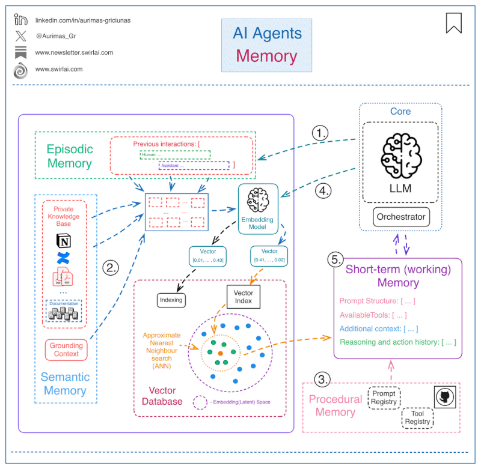

Link dump and notes on AI mostly from 2025

* [Titans: Learning to Memorize at Test Time](https://arxiv.org/pdf/2501.00663v1). A Google research paper on Titans - beyond the common transformer.

* [MarkitDown](https://github.com/microsoft/markitdown) is an MCP utility from Microsoft to convert documents in various formats to Markdown in order feed into LLM solutions. ( see also [pandoc](https://pandoc.org))

*
    

    

    Explaining Memory in AI Agents
    

    A simple way to explain AI Agent Memory.

    In general, the memory for an agent is something that we provide via context in the prompt passed to LLM that helps the agent to better plan and react given past interactions or data not immediately available.

    It is useful to group the memory into four types:

    𝟭. __Episodic__ - This type of memory contains past interactions and actions performed by the agent. After an action is taken, the application controlling the agent would store the action in some kind of persistent storage so that it can be retrieved later if needed. A good example would be using a vector Database to store semantic meaning of the interactions.

    𝟮. __Semantic__ - Any external information that is available to the agent and any knowledge the agent should have about itself. You can think of this as a context similar to one used in RAG applications. It can be internal knowledge only available to the agent or a grounding context to isolate part of the internet scale data for more accurate answers.

    𝟯. __Procedural__ - This is systemic information like the structure of the System Prompt, available tools, guardrails etc. It will usually be stored in Git, Prompt and Tool Registries.
    𝟰. Occasionally, the agent application would pull information from long-term memory and store it locally if it is needed for the task at hand.

    𝟱. All of the information pulled together from the long-term or stored in local memory is called short-term or working memory. Compiling all of it into a prompt will produce the prompt to be passed to the LLM and it will provide further actions to be taken by the system.

    We usually label 1. - 3. as Long-Term memory and 5. as Short-Term memory.

    A visual explanation of potential implementation details 
    

    From [Aurimas Griciūnas](https://lt.linkedin.com/in/aurimas-griciunas?trk=public_post_feed-actor-name)
    

* [Sean Zinsmeister on LinkedIn: AI for BI. A fun demo using Gemini](https://www.linkedin.com/posts/szinsmeister_the-future-of-ai-for-bi-is-magical-put-together-activity-7284234716960964609-4nHy?utm_source=share&utm_medium=member_ios) A video demoing BI capabilities with Google AI.

* Max Buckley on LinkedIn: [RAPTOR: Improving RAG through Semantic Cluster Summaries](https://www.linkedin.com/posts/maxbuckley_raptor-improving-rag-through-semantic-cluster-activity-7286119474238246912-F403?utm_source=share&utm_medium=member_ios). And the [RAPTOR RAG](https://arxiv.org/abs/2401.18059v1?trk=public_post_comment-text) paper.

* Aleksa Gordić on LinkedIn: [What is really Graph RAG? A Graph
RAG](https://www.linkedin.com/posts/aleksagordic_what-is-really-graph-rag-inspired-by-from-activity-7286136755194368000-nr2o?utm_source=share&utm_medium=member_ios)

* Sebastian Rashtka explaining [RLHF](https://www.linkedin.com/posts/markmoyou_conference-machinelearning-llms-ugcPost-7284797540393185280-E5Jm?utm_source=share&utm_medium=member_ios). From a talk at the [Optimised AI](https://www.linkedin.com/company/oaiconference?trk=public_post-text) Conference.

* Tutorial on building a local RAG implementation [Part1](https://jamwithai.substack.com/p/build-a-local-llm-based-rag-system) and [Part2](https://jamwithai.substack.com/p/build-a-local-llm-based-rag-system-628)

* Paper on [Search-o1: Agentic Search-Enhanced
Large Reasoning Models](https://arxiv.org/pdf/2501.05366)

* Paper on [Tree Boosting ](https://arxiv.org/pdf/1603.02754) with XGBOOST by Miquel Noguer i Alonso

*
    

    

    CAG Cache Augmented Generation
    

    Notes from Danny Wikkiams

    Long context RAG works like this:

    1. User asks a question
    2. Full documents are manually or automatically included in the prompt
    3. The LLM reads the question + the documents all at once

    This makes the prompt 𝘳𝘦𝘢𝘭𝘭𝘺 big (and expensive).

    CAG takes a completely different approach:

    1. Preloads ALL relevant documents into the LLM's inner mechanism
    2. Pre-computes the Key-Value (KV) cache from these documents
    3. Uses this cached context for all future queries

    🔑 𝗧𝗵𝗲 𝗞𝗩 𝗖𝗮𝗰𝗵𝗲 𝗠𝗮𝗴𝗶𝗰

    • During initial processing, the model computes attention patterns for all documents
    • These patterns are stored as key-value pairs
    • During inference, we can reuse these patterns instead of recomputing them

    💡 𝗞𝗲𝘆 𝗕𝗲𝗻𝗲𝗳𝗶𝘁𝘀 𝗼𝗳 𝗖𝗔𝗚

    • Eliminates retrieval latency
    • Reduces errors from document selection
    • Simplifies the overall system architecture

    ⚠️ 𝗜𝘀 𝗶𝘁 𝗮𝗹𝘄𝗮𝘆𝘀 𝗯𝗲𝘁𝘁𝗲𝗿?

    • CAG works best with limited, manageable knowledge bases. 
    • If you're using a lot of data (e.g. with a vector database like Weaviate), you will need traditional RAG
    • Currently it requires access to the model network itself, so cannot be used for larger closed sources models like GPT-4o and Claude 3.5

    I'm really excited to see future research in this area, and to see how RAG changes and develops with new and exciting papers.
    [Danny Williams on LinkedIn](https://www.linkedin.com/posts/dannyjameswilliams_okay-ill-bite-what-makes-%F0%9D%98%8A%F0%9D%98%A2%F0%9D%98%A4%F0%9D%98%A9%F0%9D%98%A6-%F0%9D%98%88-activity-7284559122434277379-Gwov?utm_source=share&utm_medium=member_ios)

    * RAG Paper [WhenCache-AugmentedGeneration is AllYouNeed for Knowledge Tasks](https://arxiv.org/pdf/2412.15605).
    

* Max Buckley on LinkedIn: [What is Speculative Decoding?](https://www.linkedin.com/posts/maxbuckley_what-is-speculative-decoding-speculative-activity-7286422871885643776-SNGb?utm_source=share&utm_medium=member_ios). The [Speculative Decoding](https://arxiv.org/pdf/2211.17192) paper, [Shallow Aggressive Decoding (SAD)](https://lnkd.in/edHYU8Bg) paper and [Blockwise Parallel Decoding for Deep Autoregressive Models]( https://lnkd.in/eFyT7CTt)

* [Comparing Apple's Metal and NVIDIA's CUDA](https://www.linkedin.com/pulse/comparing-apples-metal-nvidias-cuda-comprehensive-bojan-tunguz-ph-d--ym2te?utm_source=share&utm_medium=member_ios&utm_campaign=share_via) A
Comprehensive Analysis | Bojan Tunguz

* Val Andrei Fajardo on LinkedIn: Project:[Translating pytorch LMM to rust](https://www.linkedin.com/posts/nerdai_excited-to-share-my-latest-weekendside-project-activity-7283918780806643713-saZv?utm_source=share&utm_medium=member_ios), Why, oh why?

* Max Buckley on LinkedIn: [Medusa --- speculative decoding without a
'draft' model](https://www.linkedin.com/posts/maxbuckley_medusa-speculative-decoding-without-a-activity-7286877852396912640-XLIX?utm_source=share&utm_medium=member_ios). The [paper](https://lnkd.in/eHdS4_9u) and [IBM talk](https://lnkd.in/eYaaw7aF). In [pictures](img/medusa.jpeg)

* Max Buckley on LinkedIn: [Where did the term \"pretraining\" originate?](https://www.linkedin.com/posts/maxbuckley_where-did-the-term-pretraining-originate-activity-7280222612713078784-kHb3?utm_source=share&utm_medium=member_ios). The [BERT](https://arxiv.org/pdf/1810.04805) paper.

* Manthan Patel on LinkedIn: [How Do AI Agents Work?](https://www.linkedin.com/posts/manthanpatell_how-do-ai-agents-work-the-diagram-below-activity-7286619276130611201-qjTh?utm_source=share&utm_medium=member_ios)

* Michael Erlihson on LinkedIn: [Mathematics of Machine Learning](https://www.linkedin.com/posts/michael-erlihson-8208616_mathematics-of-machine-learning-activity-7286847994803482624-Bcg-?utm_source=share&utm_medium=member_ios)

* Paul Iusztin on LinkedIn: [LLMOps](https://www.linkedin.com/posts/pauliusztin_want-to-learn-to-build-end-to-end-production-activity-7285242189079547904-Ue6s?utm_source=share&utm_medium=member_ios), Umnn.

* [MIT Ai Risk Repository](https://airisk.mit.edu) A database of LLM Risks.

* [34 Colabs on RAG](https://github.com/NirDiamant/RAG_Techniques). A Comprehensive collection to learn RAG techniques

* The classic DeepSeek-R1 paper [Incentivizing Reasoning Capability in LLMs via Reinforcement Learning](https://arxiv.org/pdf/2501.12948) and the [Open Source reporduction](https://github.com/huggingface/open-r1). Article on [How Deepseek R1 was trained](https://www.philschmid.de/deepseek-r1)

* Max Buckley on LinkedIn: [Neural Tangent Kernel
(NTK)](https://www.linkedin.com/posts/maxbuckley_neural-tangent-kernel-ntk-if-you-want-activity-7289026900545404928-xAcb?utm_source=share&utm_medium=member_ios) Some theory on how LLMs work,

* [Group Robust Preference Optimization in Reward-free
RLHF](https://arxiv.org/abs/2405.20304) Paper

* Max Buckley on LinkedIn: [Combining Robust Optimization with Deep
Learning to Combat Adversarial Attacks](https://www.linkedin.com/posts/maxbuckley_combining-robust-optimization-with-deep-learning-activity-7289344526006059008-ceC8?utm_source=share&utm_medium=member_ios)

* AI Apps for [generating presentations](https://www.linkedin.com/posts/activity-7289391989471522816-v6E6?utm_source=share&utm_medium=member_ios)

* Everything You Should Know About [Reinforcement Learning](https://www.spiceworks.com/tech/artificial-intelligence/articles/what-is-reinforcement-learning/)

* [Kernel Methods in ML](https://machinelearningmastery.com/kernel-methods-machine-learning-python/)  with Python

* [MOE](https://cameronrwolfe.substack.com/p/moe-llms) Article. 

* Running [Deepseek R1](https://unsloth.ai/blog/deepseekr1-dynamic)

* PDF book [Introduction to ML](https://arxiv.org/pdf/2409.02668) by Laurent Younes

* 30 USD DeepSeek implementation [TinyZero](https://github.com/Jiayi-Pan/TinyZero). Or fine-tune and deploy DeepSeek R1 (8B) for under $10 [video](https://m.youtube.com/watch?v=84aVL0K9a8g) by the founder of Lightning AI

* Seb's [2024 papers](https://magazine.sebastianraschka.com/p/llm-research-papers-the-2024-list) - [articles](https://magazine.sebastianraschka.com)

* Stanford CS229 [I Machine Learning I Building Large Language Models
(LLMs)](https://m.youtube.com/watch?v=9vM4p9NN0Ts)

* Kaggle White paper on [Agents](https://www.kaggle.com/whitepaper-agents)

* Medium article [The aRt of RAG Part 3: Reranking with Cross Encoders](https://medium.com/@rossashman/the-art-of-rag-part-3-reranking-with-cross-encoders-688a16b64669)

* [GRPO training](https://github.com/ArturTanona/grpo_unsloth_docker) (the DeepSeek R1 way) with unsloth

* Training a [small maths reasoner](https://colab.research.google.com/drive/1bfhs1FMLW3FGa8ydvkOZyBNxLYOu0Hev?usp=sharing) with RL

* Philipp Schmid on LinkedIn: [Combine RAG with reasoning models like o1.
Search-o1 modifies the RAG](https://www.linkedin.com/posts/philipp-schmid-a6a2bb196_combine-rag-with-reasoning-models-like-o1-activity-7285312446490132481-jcUa?utm_source=share&utm_medium=member_ios)

* Max Buckley on LinkedIn: [SFT Memorizes, RL Generalizes: A Comparative Study of Foundation Models](https://www.linkedin.com/posts/maxbuckley_sft-memorizes-rl-generalizes-a-comparative-activity-7292301826618503169-xB0v?utm_source=share&utm_medium=member_ios&rcm=ACoAAABZGVUBskNb8NeuSOcTrjzyH8Q_HsUxWuw) and [paper](https://lnkd.in/efi-savV)

* JAX  tutorials on [how to scale your models](https://jax-ml.github.io/scaling-book/)

* [[GRPO demo ](https://gist.github.com/willccbb/4676755236bb08cab5f4e54a0475d6fb) with Llama-1B by will brown

* Medium article [LoRA Fine-Tuning On Your Apple Silicon
MacBook](https://medium.com/towards-data-science/lora-fine-tuning-on-your-apple-silicon-macbook-432c7dab614a)

* Google's [Pytorch developers guide to JAX fundamentals](https://cloud.google.com/blog/products/ai-machine-learning/guide-to-jax-for-pytorch-developers)

* Video [Deep Dive into LLMs](https://www.youtube.com/watch?v=7xTGNNLPyMI) by [Andrej Karpathy](https://karpathy.ai/)

* [Open Universal Machine Inteligence OUMI](https://github.com/oumi-ai/oumi) Everything you need to build state-of-the-art foundation models, end-to-end.

* Resources on the [Neural Tangent Kernel (NTK) and Gradient Flow](https://www.linkedin.com/posts/maxbuckley_resources-on-the-neural-tangent-kernel-ntk-activity-7289312063980531712-uB8E?utm_source=share&utm_medium=member_ios&rcm=ACoAAABZGVUBskNb8NeuSOcTrjzyH8Q_HsUxWuw) by  Max Buckley]

* 2025 RAG paper on long context matching [NOLIMA](https://arxiv.org/pdf/2502.05167) Long-Context Evaluation Beyond Literal Matching.
  NoLima is a benchmark to test if AI models can truly understand long texts.
  * Insert one key fact (called a "needle") into a long text of irrelevant information
  * Ask the AI to find and use this fact to answer a question
  * The twist: The question and the key fact use different but related words

* Sebastian Raschka's python [setup tips](https://github.com/rasbt/LLMs-from-scratch/tree/main/setup/01_optional-python-setup-preferences) and a video on [env setup](https://www.youtube.com/watch?v=yAcWnfsZhzo_)

* __Ultra-Sparse Memory Network__ ByteDance is on fire with another step in the Long March for LLM Efficiency: UltraMem trades dynamic computation (QKV attention) for efficient table lookups (PKM or Product Key Memory). By substituting compute with smart lookup, they achieve 6x faster inference and 4x compute reduction.

  This is the original [PKM proposal](https://arxiv.org/abs/1907.05242)  from Guillaume Lample (then of Meta FAIR and now of Mistral AI) et al.: 

  * Scale: A 21B parameter system organized into six memory layers. The key design choice: for each layer, selecting only the top 84 most relevant vectors (0.0026%!) per query token from millions of possibilities. Their approach uses Tucker decomposition—a tensor factorization method—to make this extremely sparse selection practical. The trick is finding the right 0.0026% quickly and accurately.

  * Results: matches model performance while running 6x faster than MoE and using 1/4 the compute. Shows how extremely sparse but precise lookup can dramatically [improve LLM efficiency](https://arxiv.org/abs/2411.12364)

  * Christopher Cuong T. [LinkedIn](https://www.linkedin.com/posts/ctnguyen_ultra-sparse-memory-network-activity-7296831820644392960-yfPW?utm_source=share&utm_medium=member_ios&rcm=ACoAAABZGVUBskNb8NeuSOcTrjzyH8Q_HsUxWuw) source.

* Hugging Face [The Ultra-Scale Playbook](https://huggingface.co/spaces/nanotron/ultrascale-playbook) Training LLMs on GPU Clusters

* 3Blue1Brown [Transformers](https://m.youtube.com/watch?v=wjZofJX0v4M) how LLMs work) explained visually

* TikTok AI Brix: [paper](https://github.com/vllm-project/aibrix/blob/main/docs/paper/AIBrix_White_Paper_0219_2025.pdf) and [repo](https://github.com/vllm-project/aibrix)
  * Think of AIbrix as Kubernetes’ hyper-caffeinated cousin who understands LLMs and LoRA adapters. Here’s what’s in the box:

    * LoRA Manager: Because cramming 10 lightweight model adaptations into one GPU should be a feature, not a crime.

    * LLM Gateway: Traffic cop for your models. No more “404 Model Not Found” after your 3rd espresso. Go Llama, Qwen, DeepSeek
    * LLM Autoscaler: Scales resources faster than a DevOps engineer during an on-callocalypse.
    * Distributed KV Cache: For when your GPUs need to gossip efficiently.
    * Hardware Failure Detection: Because GPUs do ghost you—we just help you see it coming.
    * Oh, and it runs on-prem and air-gapped for manufacturing, secretive enterprise, defense... Yes, you can finally say “my own cloud” without laughing nervously.

* Linked in list of YouTube AI/ML [videos](https://www.linkedin.com/posts/sreedath-panat_here-is-a-5-phase-8-month-roadmap-to-transition-activity-7299992873565855745-PpkL?utm_source=share&utm_medium=member_ios&rcm=ACoAAABZGVUBskNb8NeuSOcTrjzyH8Q_HsUxWuw). Treadmil fodder?

* PacktPublishing [Deep Reinforcement Learning Hands-On](https://github.com/PacktPublishing/Deep-Reinforcement-Learning-Hands-On-Third-Edition) repo to go with the book.

* Some MOE links: [Deep Speed](https://www.deepspeed.ai/tutorials/mixture-of-experts/), [NVIDIA Megatron](https://github.com/NVIDIA/Megatron-LM), [LLM Foundry](https://github.com/mosaicml/llm-foundry), [deep-seek](https://github.com/deepseek-ai/DeepEP), [Ultra-scale playbook](https://huggingface.co/spaces/nanotron/ultrascale-playbook)

* Andrej Karpathy [How I use LLMs](https://www.youtube.com/watch?v=EWvNQjAaOHw)
* Sebastian Raschka, [Build an LLM from Scratch 2: Working with text data](https://www.youtube.com/watch?v=341Rb8fJxY0) video
* [2024 __State of ML Competitions__](https://mlcontests.com/state-of-machine-learning-competitions-2024/)

* 10 Youtube Channels:
    1) [Andrej Karpathy](https://www.youtube.com/@AndrejKarpathy) – Deep yet accessible lectures on deep learning, LLMs, and an intro course on neural networks. 
    2) [3Blue1Brown](https://www.youtube.com/@3blue1brown) – Stunning visualizations that make abstract mathematical concepts intuitive. 
    3) [Lex Fridman](https://www.youtube.com/@lexfridman) – In-depth conversations with AI leaders, offering a broader perspective on the field. 
    4) [Machine Learning Street Talk](https://www.youtube.com/@MachineLearningStreetTalk) – Technical deep dives and discussions with top AI researchers.
    5) [StatQuest with Joshua Starmer](https://www.youtube.com/@statquest) – Beginner-friendly explainers on machine learning and statistics. 
    6) [Serrano Academy (Luis Serrano)](https://www.youtube.com/@SerranoAcademy) – Clear and accessible content on ML, deep learning, and AI advancements.
    7) [Jeremy Howard](https://www.youtube.com/@howardjeremyp) – Practical deep learning courses and AI-powered web app tutorials.
    8) [Hamel Husain](https://www.youtube.com/@hamelhusain7140) – Hands-on lessons in LLMs, RAG, fine-tuning, and AI evaluations.
    9) [Jason Liu](https://www.youtube.com/@jxnlco) – Expert-led lectures on RAG and AI freelancing tips for ML developers.
    10) [Dave Ebbelaar](https://www.youtube.com/@daveebbelaar) – Practical guides on building AI systems and real-world applications.

* 5 github repos for learning AI Engineering
  1. [AI Engineer Toolkit](https://github.com/break-into-data/ai-engineer-toolkit) by Break Into Data. Build your AI projects with the most popular frameworks and tools in the industry. (400 stars)
  2. [Roadmap to GenAI](https://github.com/krishnaik06/Roadmap-To-Learn-Generative-AI-In-2025) by Krish Naik. Learn fundamental concepts of deep learning and Python. (3k stars)
  3. [Awesome GenAI Guide](https://github.com/aishwaryanr/awesome-generative-ai-guide) by Aishwarya Naresh Reganti. Find research papers and online courses to upskill in GenAI. (11k stars)
  4. [AI Notes](https://github.com/swyxio/ai-notes) by Latent Space Podcast and Swyx. Find the latest tech articles from notable scientists and engineers. (5k stars)
  5. [AI Agents](https://github.com/swyxio/ai-notes) by Nir Diamant. A comprehensive guide for the development and implementation of agents. (8k stars) 

* Medium article. [How to Set Up and Use a Vector DB In Less Than 10 Minutes](https://medium.com/data-science-collective/how-to-set-up-and-use-a-vector-db-in-less-than-10-minutes-4ace45e1f9da)

* Linked in post from [Subbarao Kambhampati](https://www.linkedin.com/posts/subbarao-kambhampati-3260708_sundayharangue-activity-7303243789001707520-Xm3g?utm_source=share&utm_medium=member_ios&rcm=ACoAAABZGVUBskNb8NeuSOcTrjzyH8Q_HsUxWuw) on SFT vs RL

* LinkedIn Post [Attention vsAttention](https://www.linkedin.com/posts/shchegrikovich_attention-vs-attention-investing-in-the-activity-7304637410385055746-bvSS?utm_source=share&utm_medium=member_ios&rcm=ACoAAABZGVUBskNb8NeuSOcTrjzyH8Q_HsUxWuw)

* Max Buckley, LinkedIn [How robust are RAG systems in the presence of noise?](https://www.linkedin.com/posts/maxbuckley_how-robust-are-rag-systems-in-the-presence-activity-7299411991272587264-p3C9?utm_source=share&utm_medium=member_ios&rcm=ACoAAABZGVUBskNb8NeuSOcTrjzyH8Q_HsUxWuw)

* DeepSeek from Scratch ( youtube) - ...embedded sponsorship.
  (1) DeepSeek series [introduction](https://www.youtube.com/watch?v=QWNxQIq0hMo&feature=youtu.be) video.
  (2) DeepSeek [basics](https://www.youtube.com/watch?v=WjhDDeZ7DvM)
  (3) Journey of a token into the [LLM architecture](https://www.youtube.com/watch?v=rkEYwH4UGa4&feature=youtu.be)
  (4) [Attention](https://www.youtube.com/watch?v=K45ze9Yd5UE) mechanism explained in 1 hour

<!--

[[Now... \| Raj Abhijit Dandekar \| 23
comments]{.underline}](https://www.linkedin.com/posts/raj-abhijit-dandekar-67a33118a_i-am-glad-i-returned-to-india-after-my-machine-activity-7305203364810698754-lX9Y?utm_source=share&utm_medium=member_ios&rcm=ACoAAABZGVUBskNb8NeuSOcTrjzyH8Q_HsUxWuw)

[[SHAP is certainly one of the most used techniques for explainable AI
these... \| Damien Benveniste,
PhD]{.underline}](https://www.linkedin.com/posts/damienbenveniste_shap-is-certainly-one-of-the-most-used-techniques-activity-7303630116104900608-omGC?utm_source=share&utm_medium=member_ios&rcm=ACoAAABZGVUBskNb8NeuSOcTrjzyH8Q_HsUxWuw)

[[This maths book is trending on Hacker
News.]{.underline}](https://www.linkedin.com/posts/eric-vyacheslav-156273169_this-maths-book-is-trending-on-hacker-news-activity-7305543323807625216-adkZ?utm_source=share&utm_medium=member_ios&rcm=ACoAAABZGVUBskNb8NeuSOcTrjzyH8Q_HsUxWuw)

[[This 700-page book teaches... \| Eric
Vyacheslav]{.underline}](https://www.linkedin.com/posts/eric-vyacheslav-156273169_this-maths-book-is-trending-on-hacker-news-activity-7305543323807625216-adkZ?utm_source=share&utm_medium=member_ios&rcm=ACoAAABZGVUBskNb8NeuSOcTrjzyH8Q_HsUxWuw)

[[See Barry Smith[']{dir="rtl"}s activity on
LinkedIn]{.underline}](https://www.linkedin.com/feed/update/urn:li:activity:7306370387712327682?utm_source=share&utm_medium=member_ios&rcm=ACoAAABZGVUBskNb8NeuSOcTrjzyH8Q_HsUxWuw)

[[82% of jobs in 2025 now require AI
skills]{.underline}](https://www.linkedin.com/posts/nimritadadlani_82-of-jobs-in-2025-now-require-ai-skills-activity-7305921510802612224-ekd9?utm_source=share&utm_medium=member_ios&rcm=ACoAAABZGVUBskNb8NeuSOcTrjzyH8Q_HsUxWuw)

[[8 (free) masterclasses from... \| Nimrita Dadlani \| 49
comments]{.underline}](https://www.linkedin.com/posts/nimritadadlani_82-of-jobs-in-2025-now-require-ai-skills-activity-7305921510802612224-ekd9?utm_source=share&utm_medium=member_ios&rcm=ACoAAABZGVUBskNb8NeuSOcTrjzyH8Q_HsUxWuw)

[[New paper: turns out you can train deep nets without normalization
layers... \| Yann LeCun \| 135
comments]{.underline}](https://www.linkedin.com/posts/yann-lecun_new-paper-turns-out-you-can-train-deep-nets-activity-7306387055909961728-OA8w?utm_source=share&utm_medium=member_ios&rcm=ACoAAABZGVUBskNb8NeuSOcTrjzyH8Q_HsUxWuw)

[[Let\'s finetune and deploy DeepSeek R1 (8B) for under
\$10]{.underline}](https://m.youtube.com/watch?v=84aVL0K9a8g)

[[This repo covers everything you need to know about
MLOps.]{.underline}](https://www.linkedin.com/posts/eric-vyacheslav-156273169_this-repo-covers-everything-you-need-to-know-activity-7307007865024585729-4wyx?utm_source=share&utm_medium=member_ios&rcm=ACoAAABZGVUBskNb8NeuSOcTrjzyH8Q_HsUxWuw)

[[The goal of the... \| Eric
Vyacheslav]{.underline}](https://www.linkedin.com/posts/eric-vyacheslav-156273169_this-repo-covers-everything-you-need-to-know-activity-7307007865024585729-4wyx?utm_source=share&utm_medium=member_ios&rcm=ACoAAABZGVUBskNb8NeuSOcTrjzyH8Q_HsUxWuw)

[[If I had to start over with system design today, here\'s what I\'d
learn... \| Neo Kim \| 62
comments]{.underline}](https://www.linkedin.com/posts/nk-systemdesign-one_if-i-had-to-start-over-with-system-design-activity-7304856987815542784-bwHC?utm_source=share&utm_medium=member_ios&rcm=ACoAAABZGVUBskNb8NeuSOcTrjzyH8Q_HsUxWuw)

[[𝗢𝗻𝗲 𝗼𝗳 𝘁𝗵𝗲 𝗠𝗢𝗦𝗧 𝗱𝗶𝘀𝗰𝘂𝘀𝘀𝗲𝗱 𝗾𝘂𝗲𝘀𝘁𝗶𝗼𝗻: 𝗛𝗼𝘄... \| Andreas Horn \| 66
comments]{.underline}](https://www.linkedin.com/posts/andreashorn1_%F0%9D%97%A2%F0%9D%97%BB%F0%9D%97%B2-%F0%9D%97%BC%F0%9D%97%B3-%F0%9D%98%81%F0%9D%97%B5%F0%9D%97%B2-%F0%9D%97%A0%F0%9D%97%A2%F0%9D%97%A6%F0%9D%97%A7-%F0%9D%97%B1%F0%9D%97%B6%F0%9D%98%80%F0%9D%97%B0%F0%9D%98%82%F0%9D%98%80%F0%9D%98%80%F0%9D%97%B2%F0%9D%97%B1-activity-7306961323286827008-CZFK?utm_source=share&utm_medium=member_ios&rcm=ACoAAABZGVUBskNb8NeuSOcTrjzyH8Q_HsUxWuw)

[[🚀 Open-Sourcing my Stanford University Course: Building LLM
Applications... \| Hamza Farooq \| 105
comments]{.underline}](https://www.linkedin.com/posts/hamzafarooq_open-sourcing-my-stanford-university-course-activity-7306939137943642112-Lers?utm_source=share&utm_medium=member_ios&rcm=ACoAAABZGVUBskNb8NeuSOcTrjzyH8Q_HsUxWuw)

[[#ai #llm #learning \| Eduardo Ordax \| 29
comments]{.underline}](https://www.linkedin.com/posts/eordax_ai-llm-learning-activity-7307373325503094785-Szcz?utm_source=share&utm_medium=member_ios&rcm=ACoAAABZGVUBskNb8NeuSOcTrjzyH8Q_HsUxWuw)

Gpro free

[[Google Colab
Notebook]{.underline}](https://colab.research.google.com/github/unslothai/notebooks/blob/main/nb/HuggingFace%20Course-Gemma3_(1B)-GRPO.ipynb)

[[Stanford just uploaded their new \"Building LLMS\" lecture. It\'s a
must... \| Eric Vyacheslav \| 16
comments]{.underline}](https://www.linkedin.com/posts/eric-vyacheslav-156273169_stanford-just-uploaded-their-new-building-activity-7309182181854064640-hWzA?utm_source=share&utm_medium=member_ios&rcm=ACoAAABZGVUBskNb8NeuSOcTrjzyH8Q_HsUxWuw)

[[2 Q L \| Dr Miquel Noguer i
Alonso]{.underline}](https://www.linkedin.com/posts/dr-miquel-noguer-i-alonso-7242345_2-q-l-activity-7309329363164979200-btMB?utm_source=share&utm_medium=member_ios&rcm=ACoAAABZGVUBskNb8NeuSOcTrjzyH8Q_HsUxWuw)

[[#artificialintelligence #deeplearning #machinelearning #hpc \| Alex
Razvant \| 24
comments]{.underline}](https://www.linkedin.com/posts/arazvant_artificialintelligence-deeplearning-machinelearning-activity-7307697415707398144-3j1Y?utm_source=share&utm_medium=member_ios&rcm=ACoAAABZGVUBskNb8NeuSOcTrjzyH8Q_HsUxWuw)

[[My next tutorial on pretraining an LLM from scratch is now out. It
starts... \| Sebastian Raschka,
PhD]{.underline}](https://www.linkedin.com/posts/sebastianraschka_my-next-tutorial-on-pretraining-an-llm-from-activity-7309569006057795584-d4zd?utm_source=share&utm_medium=member_ios&rcm=ACoAAABZGVUBskNb8NeuSOcTrjzyH8Q_HsUxWuw)

[[sail-sg/understand-r1-zero: Understanding R1-Zero-Like Training: A
Critical
Perspective]{.underline}](https://github.com/sail-sg/understand-r1-zero)

[[2503]{.underline}](https://arxiv.org/pdf/2503.06751)

[[Copy of
GRPO_Countdown.ipynb]{.underline}](https://colab.research.google.com/drive/1bURdkV_StTbTsYgisUPHaHJqeAr-hMGz?usp=sharing)

[[I implemented a Llama 3.2 model from scratch and shared it on the
HF... \| Sebastian Raschka, PhD \| 30
comments]{.underline}](https://www.linkedin.com/posts/sebastianraschka_i-implemented-a-llama-32-model-from-scratch-activity-7312523216051191808-oevJ?utm_source=share&utm_medium=member_ios&rcm=ACoAAABZGVUBskNb8NeuSOcTrjzyH8Q_HsUxWuw)

[[MCP server for WhatsApp. Connects to your WhatsApp account and lets
you... \| Eric
Vyacheslav]{.underline}](https://www.linkedin.com/posts/eric-vyacheslav-156273169_mcp-server-for-whatsapp-connects-to-your-activity-7312582522217865216-GJ6N?utm_source=share&utm_medium=member_ios&rcm=ACoAAABZGVUBskNb8NeuSOcTrjzyH8Q_HsUxWuw)

[[This repo covers everything you need to know about
MLOps.]{.underline}](https://www.linkedin.com/posts/eric-vyacheslav-156273169_this-repo-covers-everything-you-need-to-know-activity-7307007865024585729-4wyx?utm_source=share&utm_medium=member_ios&rcm=ACoAAABZGVUBskNb8NeuSOcTrjzyH8Q_HsUxWuw)

[[The goal of the... \| Eric Vyacheslav \| 75
comments]{.underline}](https://www.linkedin.com/posts/eric-vyacheslav-156273169_this-repo-covers-everything-you-need-to-know-activity-7307007865024585729-4wyx?utm_source=share&utm_medium=member_ios&rcm=ACoAAABZGVUBskNb8NeuSOcTrjzyH8Q_HsUxWuw)

[[graviraja/MLOps-Basics]{.underline}](https://github.com/graviraja/MLOps-Basics)

[[ggozad/oterm: a text-based terminal client for
Ollama]{.underline}](https://github.com/ggozad/oterm)

[[I just shared a new article: \"The State of Reinforcement Learning for
LLM... \| Sebastian Raschka, PhD \| 13
comments]{.underline}](https://www.linkedin.com/posts/sebastianraschka_i-just-shared-a-new-article-the-state-of-activity-7319355742178660352-8x8M?utm_source=share&utm_medium=member_ios&rcm=ACoAAABZGVUBskNb8NeuSOcTrjzyH8Q_HsUxWuw)

[[I heard a lot of praise for this year edition (still running!) of
\"CS336:... \| Roman
Vorushin]{.underline}](https://www.linkedin.com/feed/update/urn:li:activity:7319635924621926400?commentUrn=urn%3Ali%3Acomment%3A%28activity%3A7319635924621926400%2C7319636085385379840%29&dashCommentUrn=urn%3Ali%3Afsd_comment%3A%287319636085385379840%2Curn%3Ali%3Aactivity%3A7319635924621926400%29)

[[NoProp: Training Neural Networks without Back-propagation or
Forward-propagation]{.underline}](https://arxiv.org/abs/2503.24322)

[[The internet is going wild for OpenAI\'s GPT-4o native image
generation... \| Max Buckley \| 25
comments]{.underline}](https://www.linkedin.com/posts/maxbuckley_the-internet-is-going-wild-for-openais-gpt-activity-7314050833048821762-XNL8?utm_source=share&utm_medium=member_ios&rcm=ACoAAABZGVUBskNb8NeuSOcTrjzyH8Q_HsUxWuw)

[[OpenAI\'s o3: Over-optimization is back and weirder than
ever]{.underline}](https://www.interconnects.ai/p/openais-o3-over-optimization-is-back?utm_source=activity_item)

[[Majorly improving your RAG
system]{.underline}](https://www.linkedin.com/posts/maxbuckley_majorly-improving-your-rag-system-naive-activity-7314258457023442944-XxYp?utm_source=share&utm_medium=member_ios&rcm=ACoAAABZGVUBskNb8NeuSOcTrjzyH8Q_HsUxWuw)

[[Naive RAG systems break documents into... \| Max Buckley \| 14
comments]{.underline}](https://www.linkedin.com/posts/maxbuckley_majorly-improving-your-rag-system-naive-activity-7314258457023442944-XxYp?utm_source=share&utm_medium=member_ios&rcm=ACoAAABZGVUBskNb8NeuSOcTrjzyH8Q_HsUxWuw)

[[I am glad I returned to India after my Machine Learning PhD at
MIT.]{.underline}](https://www.linkedin.com/posts/raj-abhijit-dandekar-67a33118a_i-am-glad-i-returned-to-india-after-my-machine-activity-7318241789134479361-PaQJ?utm_source=share&utm_medium=member_ios&rcm=ACoAAABZGVUBskNb8NeuSOcTrjzyH8Q_HsUxWuw)

[[Now... \| Raj Abhijit Dandekar \| 100
comments]{.underline}](https://www.linkedin.com/posts/raj-abhijit-dandekar-67a33118a_i-am-glad-i-returned-to-india-after-my-machine-activity-7318241789134479361-PaQJ?utm_source=share&utm_medium=member_ios&rcm=ACoAAABZGVUBskNb8NeuSOcTrjzyH8Q_HsUxWuw)

[[Scalable-Softmax Is Superior for
Attention]{.underline}](https://www.linkedin.com/posts/maxbuckley_scalable-softmax-is-superior-for-attention-activity-7314393556763181058-Zclz?utm_source=share&utm_medium=member_ios&rcm=ACoAAABZGVUBskNb8NeuSOcTrjzyH8Q_HsUxWuw)

[[This is an incredible paper... \| Max
Buckley]{.underline}](https://www.linkedin.com/posts/maxbuckley_scalable-softmax-is-superior-for-attention-activity-7314393556763181058-Zclz?utm_source=share&utm_medium=member_ios&rcm=ACoAAABZGVUBskNb8NeuSOcTrjzyH8Q_HsUxWuw)

[[In one of our office conversations: me and Sreedath Panat were
discussing... \| Raj Abhijit Dandekar \| 11
comments]{.underline}](https://www.linkedin.com/posts/raj-abhijit-dandekar-67a33118a_in-one-of-our-office-conversations-me-and-activity-7320650131408568321-IUvl?utm_source=share&utm_medium=member_ios&rcm=ACoAAABZGVUBskNb8NeuSOcTrjzyH8Q_HsUxWuw)

[[OpenAI\'s Speculative Decoding, Reverse-Engineered \| Max
Buckley]{.underline}](https://www.linkedin.com/posts/maxbuckley_openais-speculative-decoding-reverse-engineered-activity-7321126498348814336-B5ew?utm_source=share&utm_medium=member_ios&rcm=ACoAAABZGVUBskNb8NeuSOcTrjzyH8Q_HsUxWuw)

[[Best 7 GitHub repos to pass AI / ML
interviews:]{.underline}](https://www.linkedin.com/posts/stasbel_best-7-github-repos-to-pass-ai-ml-interviews-activity-7318916839051313152-vfxj?utm_source=share&utm_medium=member_ios&rcm=ACoAAABZGVUBskNb8NeuSOcTrjzyH8Q_HsUxWuw)

[[I use AI a lot at my... \| Stanislav Beliaev \| 23
comments]{.underline}](https://www.linkedin.com/posts/stasbel_best-7-github-repos-to-pass-ai-ml-interviews-activity-7318916839051313152-vfxj?utm_source=share&utm_medium=member_ios&rcm=ACoAAABZGVUBskNb8NeuSOcTrjzyH8Q_HsUxWuw)

[[The Inmates are Running the Asylum: The Unforeseen Consequences of
LLMs... \| Max
Buckley]{.underline}](https://www.linkedin.com/posts/maxbuckley_the-inmates-are-running-the-asylum-the-unforeseen-activity-7321973181936799744-ld7K?utm_source=share&utm_medium=member_ios&rcm=ACoAAABZGVUBskNb8NeuSOcTrjzyH8Q_HsUxWuw)

[[#datascience #machinelearning #ai \| Felipe Buchbinder \| 146
comments]{.underline}](https://www.linkedin.com/posts/felipe-buchbinder_datascience-machinelearning-ai-activity-7321518403943317504-bqfL?utm_source=share&utm_medium=member_ios&rcm=ACoAAABZGVUBskNb8NeuSOcTrjzyH8Q_HsUxWuw)

[[#machinelearning #deeplearning #artificialintelligence \| Alex Razvant
\| 26
comments]{.underline}](https://www.linkedin.com/posts/arazvant_machinelearning-deeplearning-artificialintelligence-activity-7322537864863334401-qNhA?utm_source=share&utm_medium=member_ios&rcm=ACoAAABZGVUBskNb8NeuSOcTrjzyH8Q_HsUxWuw)

[[A user on X with an unmentionable username asked OpenAI\'s
gpt-image-1... \| Andriy Burkov \| 137
comments]{.underline}](https://www.linkedin.com/posts/andriyburkov_a-user-on-x-with-an-unmentionable-username-ugcPost-7322757593838333952-I5FX?utm_source=share&utm_medium=member_ios&rcm=ACoAAABZGVUBskNb8NeuSOcTrjzyH8Q_HsUxWuw)

[[Four years ago, the Geometric Deep Learning proto-book hit the
arXiv... \| Petar
Veličković]{.underline}](https://www.linkedin.com/posts/petarvelickovic_four-years-ago-the-geometric-deep-learning-activity-7322770901958062080-KBpe?utm_source=share&utm_medium=member_ios&rcm=ACoAAABZGVUBskNb8NeuSOcTrjzyH8Q_HsUxWuw)

[[You don[']{dir="rtl"}t need a PhD to understand PPO --- or even GRPO.
At least, I hope... \| Haitham
Bou-Ammar]{.underline}](https://www.linkedin.com/posts/haitham-bou-ammar-a723a932_you-dont-need-a-phd-to-understand-ppo-activity-7314287698637197313-8uC3?utm_source=share&utm_medium=member_ios&rcm=ACoAAABZGVUBskNb8NeuSOcTrjzyH8Q_HsUxWuw)

[[#ai \| Denis O. \| 66
comments]{.underline}](https://www.linkedin.com/posts/denis-o-b61a379a_ai-activity-7323525110466760705-orsa?utm_source=share&utm_medium=member_ios&rcm=ACoAAABZGVUBskNb8NeuSOcTrjzyH8Q_HsUxWuw)

[[oumi/notebooks/Oumi - Finetuning Tutorial.ipynb at main ·
oumi-ai/oumi]{.underline}](https://github.com/oumi-ai/oumi/blob/main/notebooks/Oumi%20-%20Finetuning%20Tutorial.ipynb)

[[I\'m preparing for a talk tomorrow and came across this interesting
(but... \| Sebastian Raschka, PhD \| 47
comments]{.underline}](https://www.linkedin.com/posts/sebastianraschka_im-preparing-for-a-talk-tomorrow-and-came-activity-7315752927107719168-OO1Q?utm_source=share&utm_medium=member_ios&rcm=ACoAAABZGVUBskNb8NeuSOcTrjzyH8Q_HsUxWuw)

[[Enabling 1 MW IT racks and liquid cooling at OCP EMEA Summit \| Google
Cloud
Blog]{.underline}](https://cloud.google.com/blog/topics/systems/enabling-1-mw-it-racks-and-liquid-cooling-at-ocp-emea-summit)

[[Experimenting with Reinforcement Learning with Verifiable Rewards
(RLVR)]{.underline}](https://m.youtube.com/watch?v=zYeIqzULzr0)

[[You can build an MCP server in just 3 steps with Gemini 2.5
Pro.]{.underline}](https://www.linkedin.com/posts/alphasignal_you-can-build-an-mcp-server-in-just-3-steps-activity-7324810476100472832-yhmX?utm_source=share&utm_medium=member_ios&rcm=ACoAAABZGVUBskNb8NeuSOcTrjzyH8Q_HsUxWuw)

[[Convert... \|
AlphaSignal]{.underline}](https://www.linkedin.com/posts/alphasignal_you-can-build-an-mcp-server-in-just-3-steps-activity-7324810476100472832-yhmX?utm_source=share&utm_medium=member_ios&rcm=ACoAAABZGVUBskNb8NeuSOcTrjzyH8Q_HsUxWuw)

[[Agent AI and Jupyter Notebooks - not my thing!
🤯]{.underline}](https://www.linkedin.com/posts/shantanuladhwe_agent-ai-and-jupyter-notebooks-not-my-thing-activity-7324066793608622080-JdCc?utm_source=share&utm_medium=member_ios&rcm=ACoAAABZGVUBskNb8NeuSOcTrjzyH8Q_HsUxWuw)

[[If you[']{dir="rtl"}re like me... \| Shantanu Ladhwe \| 24
comments]{.underline}](https://www.linkedin.com/posts/shantanuladhwe_agent-ai-and-jupyter-notebooks-not-my-thing-activity-7324066793608622080-JdCc?utm_source=share&utm_medium=member_ios&rcm=ACoAAABZGVUBskNb8NeuSOcTrjzyH8Q_HsUxWuw)

[[VPP in Containerlab - Part 1 - Docker \| Pim van
Pelt]{.underline}](https://www.linkedin.com/posts/pimvanpelt_vpp-activity-7325110118277087232-hXOP?utm_source=share&utm_medium=member_ios&rcm=ACoAAABZGVUBskNb8NeuSOcTrjzyH8Q_HsUxWuw)

[[Multi-vendor support for dropped packet
notifications]{.underline}](https://blog.sflow.com/2025/05/multi-vendor-support-for-dropped-packet.html?m=1)

[[First draft online version of The RLHF Book is DONE. Recently I\'ve
been... \| Nathan Lambert \| 28
comments]{.underline}](https://www.linkedin.com/posts/natolambert_first-draft-online-version-of-the-rlhf-book-activity-7318347860587003908-QDWR?utm_source=share&utm_medium=member_ios&rcm=ACoAAABZGVUBskNb8NeuSOcTrjzyH8Q_HsUxWuw)

[[Is LoRA (Low Rank Adaptation) relevant in 2025 for reasoning
models?]{.underline}](https://www.linkedin.com/posts/sebastianraschka_is-lora-low-rank-adaptation-relevant-in-activity-7325873101932507137-E9b4?utm_source=share&utm_medium=member_ios&rcm=ACoAAABZGVUBskNb8NeuSOcTrjzyH8Q_HsUxWuw)

[[I... \| Sebastian Raschka, PhD \| 30
comments]{.underline}](https://www.linkedin.com/posts/sebastianraschka_is-lora-low-rank-adaptation-relevant-in-activity-7325873101932507137-E9b4?utm_source=share&utm_medium=member_ios&rcm=ACoAAABZGVUBskNb8NeuSOcTrjzyH8Q_HsUxWuw)

[[afshinea/stanford-cme-295-transformers-large-language-models: VIP
cheatsheet for Stanford\'s CME 295 Transformers and Large Language
Models]{.underline}](https://github.com/afshinea/stanford-cme-295-transformers-large-language-models)

[[lecun-20250427-nus120.pdf]{.underline}](https://drive.google.com/file/d/1j3A8SYtkJqui7CotCMuvES2LpR17JYrQ/view)

[[Gemini 2.5[']{dir="rtl"}s ability to comprehend video is
incredible.]{.underline}](https://www.linkedin.com/posts/eric-vyacheslav-156273169_gemini-25s-ability-to-comprehend-video-activity-7327301852293668865-OzvI?utm_source=share&utm_medium=member_ios&rcm=ACoAAABZGVUBskNb8NeuSOcTrjzyH8Q_HsUxWuw)

[[1. Take a screen... \| Eric
Vyacheslav]{.underline}](https://www.linkedin.com/posts/eric-vyacheslav-156273169_gemini-25s-ability-to-comprehend-video-activity-7327301852293668865-OzvI?utm_source=share&utm_medium=member_ios&rcm=ACoAAABZGVUBskNb8NeuSOcTrjzyH8Q_HsUxWuw)

[[There goes a few hours on Saturday 🙈 \| Max
Buckley]{.underline}](https://www.linkedin.com/posts/maxbuckley_new-course-on-mcp-with-anthropic-in-activity-7328653606469967872-OQE2?utm_source=share&utm_medium=member_ios&rcm=ACoAAABZGVUBskNb8NeuSOcTrjzyH8Q_HsUxWuw)

[[We[']{dir="rtl"}re very pleased to release our latest study
[']{dir="rtl"}Emergence of Language in... \| Linnea Evanson,
PhD]{.underline}](https://www.linkedin.com/posts/linnea-evanson_were-very-pleased-to-release-our-latest-ugcPost-7328712746814930946-UBtZ?utm_source=share&utm_medium=member_ios&rcm=ACoAAABZGVUBskNb8NeuSOcTrjzyH8Q_HsUxWuw)

[[How diffusion LLMs outperform traditional models \| Laurie Kirk posted
on the topic \|
LinkedIn]{.underline}](https://www.linkedin.com/posts/laurie-kirk_what-if-language-models-wrote-the-same-way-activity-7325231198337728513-EeKP?utm_source=share&utm_medium=member_ios&rcm=ACoAAABZGVUBskNb8NeuSOcTrjzyH8Q_HsUxWuw)

[[Large Language Model
Systems]{.underline}](https://llmsystem.github.io/llmsystem2025spring/)

[[Yann LeCun: Models of SSL (April 29, 2025) \| Yann
LeCun]{.underline}](https://www.linkedin.com/posts/yann-lecun_yann-lecun-models-of-ssl-april-29-2025-activity-7329221527843782656-v8v5?utm_source=share&utm_medium=member_ios&rcm=ACoAAABZGVUBskNb8NeuSOcTrjzyH8Q_HsUxWuw)

[[Ilya Sutskever (OpenAI cofounder) top 30 must-read research papers:
\"If... \| Lior Alexander \| 26
comments]{.underline}](https://www.linkedin.com/posts/lioralex_ilya-sutskever-openai-cofounder-top-30-activity-7320189012059586560-IfvV?utm_source=share&utm_medium=member_ios&rcm=ACoAAABZGVUBskNb8NeuSOcTrjzyH8Q_HsUxWuw)

[[How to speed up scikit-learn with NVIDIA GPUs \| Mariya Sha posted on
the topic \|
LinkedIn]{.underline}](https://www.linkedin.com/posts/mariyasha888_machinelearning-scikitlearn-nvidia-ugcPost-7325209886126997504-sh9m?utm_source=share&utm_medium=member_ios&rcm=ACoAAABZGVUBskNb8NeuSOcTrjzyH8Q_HsUxWuw)

[Text-to-SQL
Tutorial](https://www.linkedin.com/posts/langchain_text-to-sql-tutorial-build-a-powerful-activity-7329536234786054144-Su-6?utm_source=share&utm_medium=member_ios&rcm=ACoAAABZGVUBskNb8NeuSOcTrjzyH8Q_HsUxWuw)

[[Build a powerful natural language to SQL... \|
LangChain]{.underline}](https://www.linkedin.com/posts/langchain_text-to-sql-tutorial-build-a-powerful-activity-7329536234786054144-Su-6?utm_source=share&utm_medium=member_ios&rcm=ACoAAABZGVUBskNb8NeuSOcTrjzyH8Q_HsUxWuw)

[[LangGraph Platform: Deploy, scale, and manage agents for stateful
workflows \| LangChain posted on the topic \|
LinkedIn]{.underline}](https://www.linkedin.com/posts/langchain_langgraph-platform-is-now-generally-available-activity-7328475438912098304-55er?utm_source=share&utm_medium=member_ios&rcm=ACoAAABZGVUBskNb8NeuSOcTrjzyH8Q_HsUxWuw)

[[How to master ML: blogs and resources \| Pramod Goyal posted on the
topic \|
LinkedIn]{.underline}](https://www.linkedin.com/posts/goyalpramod_ai-ml-llm-activity-7328806102869913600-tk0Q?utm_source=share&utm_medium=member_ios&rcm=ACoAAABZGVUBskNb8NeuSOcTrjzyH8Q_HsUxWuw)

[[Whether to use Fine-tuning or RAG: Why Not
Both?]{.underline}](https://www.linkedin.com/posts/maxbuckley_whether-to-use-fine-tuning-or-rag-why-not-activity-7324091215027539970-DGAA?utm_source=share&utm_medium=member_ios&rcm=ACoAAABZGVUBskNb8NeuSOcTrjzyH8Q_HsUxWuw)

[[Retrieval Augmented... \| Max
Buckley]{.underline}](https://www.linkedin.com/posts/maxbuckley_whether-to-use-fine-tuning-or-rag-why-not-activity-7324091215027539970-DGAA?utm_source=share&utm_medium=member_ios&rcm=ACoAAABZGVUBskNb8NeuSOcTrjzyH8Q_HsUxWuw)

[[Fine-tuning massive LLMs used to be painfully
slow.]{.underline}](https://www.linkedin.com/posts/mary-newhauser-02273551_fine-tuning-massive-llms-used-to-be-painfully-activity-7330254935114067969-5UhA?utm_source=share&utm_medium=member_ios&rcm=ACoAAABZGVUBskNb8NeuSOcTrjzyH8Q_HsUxWuw)

[[Or downright... \| Mary Newhauser \| 78
comments]{.underline}](https://www.linkedin.com/posts/mary-newhauser-02273551_fine-tuning-massive-llms-used-to-be-painfully-activity-7330254935114067969-5UhA?utm_source=share&utm_medium=member_ios&rcm=ACoAAABZGVUBskNb8NeuSOcTrjzyH8Q_HsUxWuw)

[[AI Foundry: DeepSeek\'s paper on AI infrastructure engineering \|
Srinivas Lingam posted on the topic \|
LinkedIn]{.underline}](https://www.linkedin.com/posts/slingam_artificialintelligence-computerarchitecture-activity-7328732976807059457-wbTr?utm_source=share&utm_medium=member_ios&rcm=ACoAAABZGVUBskNb8NeuSOcTrjzyH8Q_HsUxWuw)

[[If you want to get the distilled wisdom of the LLM architecture
changes in... \| Roman
Vorushin]{.underline}](https://www.linkedin.com/posts/vorushin_if-you-want-to-get-the-distilled-wisdom-of-ugcPost-7331203082740994049-B6fX?utm_source=share&utm_medium=member_ios&rcm=ACoAAABZGVUBskNb8NeuSOcTrjzyH8Q_HsUxWuw)

[[LoRA boosts reasoning models, a surprise in 2025 \| Sebastian Raschka,
PhD posted on the topic \|
LinkedIn]{.underline}](https://www.linkedin.com/posts/sebastianraschka_is-lora-low-rank-adaptation-relevant-in-activity-7325873101932507137-E9b4?utm_source=share&utm_medium=member_ios&rcm=ACoAAABZGVUBskNb8NeuSOcTrjzyH8Q_HsUxWuw)

[[A comprehensive 115-page guide to fine-tuning LLMs just dropped on
arXiv... \|
AlphaSignal]{.underline}](https://www.linkedin.com/posts/alphasignal_a-comprehensive-115-page-guide-to-fine-tuning-activity-7332012895175680000-u8Qr?utm_source=share&utm_medium=member_ios&rcm=ACoAAABZGVUBskNb8NeuSOcTrjzyH8Q_HsUxWuw)

[[Huh. Looks like Plato was
right.]{.underline}](https://www.linkedin.com/posts/emollick_huh-looks-like-plato-was-right-a-new-paper-activity-7331511092277370883-3Ba3?utm_source=share&utm_medium=member_ios&rcm=ACoAAABZGVUBskNb8NeuSOcTrjzyH8Q_HsUxWuw)

[[A new paper shows all language models... \| Ethan Mollick \| 231
comments]{.underline}](https://www.linkedin.com/posts/emollick_huh-looks-like-plato-was-right-a-new-paper-activity-7331511092277370883-3Ba3?utm_source=share&utm_medium=member_ios&rcm=ACoAAABZGVUBskNb8NeuSOcTrjzyH8Q_HsUxWuw)

[[🚀 𝗠𝗖𝗣: 𝗧𝗵𝗲 𝗕𝘂𝘇𝘇 𝗜𝘀
𝗥𝗲𝗮𝗹 ]{.underline}](https://www.linkedin.com/posts/akashaggarwalproductmanager_%F0%9D%97%A0%F0%9D%97%96%F0%9D%97%A3-%F0%9D%97%A7%F0%9D%97%B5%F0%9D%97%B2-%F0%9D%97%95%F0%9D%98%82%F0%9D%98%87%F0%9D%98%87-%F0%9D%97%9C%F0%9D%98%80-%F0%9D%97%A5%F0%9D%97%B2%F0%9D%97%AE%F0%9D%97%B9-activity-7331676732770455552-yeVA?utm_source=share&utm_medium=member_ios&rcm=ACoAAABZGVUBskNb8NeuSOcTrjzyH8Q_HsUxWuw)

[[Over the last few weeks, I[']{dir="rtl"}ve... \| Akash
Aggarwal]{.underline}](https://www.linkedin.com/posts/akashaggarwalproductmanager_%F0%9D%97%A0%F0%9D%97%96%F0%9D%97%A3-%F0%9D%97%A7%F0%9D%97%B5%F0%9D%97%B2-%F0%9D%97%95%F0%9D%98%82%F0%9D%98%87%F0%9D%98%87-%F0%9D%97%9C%F0%9D%98%80-%F0%9D%97%A5%F0%9D%97%B2%F0%9D%97%AE%F0%9D%97%B9-activity-7331676732770455552-yeVA?utm_source=share&utm_medium=member_ios&rcm=ACoAAABZGVUBskNb8NeuSOcTrjzyH8Q_HsUxWuw)

[[#llm #nlp #opensource #ai #machinelearning #python #deeplearning \|
Charly
Wargnier]{.underline}](https://www.linkedin.com/posts/charlywargnier_llm-nlp-opensource-activity-7332427376628297728-7PtU?utm_source=share&utm_medium=member_ios&rcm=ACoAAABZGVUBskNb8NeuSOcTrjzyH8Q_HsUxWuw)

[[Max Buckley, congratulations on completing MCP: Build Rich-Context AI
Apps... \| Max
Buckley]{.underline}](https://www.linkedin.com/posts/maxbuckley_max-buckley-congratulations-on-completing-activity-7329927770547843072-hkZp?utm_source=share&utm_medium=member_ios&rcm=ACoAAABZGVUBskNb8NeuSOcTrjzyH8Q_HsUxWuw)

[[I am a data scientist building AI Agents in production\...
here[']{dir="rtl"}s the truth... \| Shirin Khosravi Jam \| 116
comments]{.underline}](https://www.linkedin.com/posts/shirin-khosravi-jam_i-am-a-data-scientist-building-ai-agents-activity-7336670186231496705-MKgJ?utm_source=share&utm_medium=member_ios&rcm=ACoAAABZGVUBskNb8NeuSOcTrjzyH8Q_HsUxWuw)

[[How random rewards boost LLM\'s coding skills \| Cameron R. Wolfe,
Ph.D. posted on the topic \|
LinkedIn]{.underline}](https://www.linkedin.com/posts/cameron-r-wolfe-ph-d-04744a238_why-are-top-llm-labs-focusing-so-much-on-activity-7336096864724840459-YihU?utm_source=share&utm_medium=member_ios&rcm=ACoAAABZGVUBskNb8NeuSOcTrjzyH8Q_HsUxWuw)

[[Policy
Gradient]{.underline}](https://rlhfbook.com/c/11-policy-gradients.html)

[[Algorithms \| RLHF Book by Nathan
Lambert]{.underline}](https://rlhfbook.com/c/11-policy-gradients.html)

[[Reading recent reports about reasoning models I noticed patterns in
their loss functions. \| Roman
Vorushin]{.underline}](https://www.linkedin.com/posts/vorushin_reading-recent-reports-about-reasoning-models-ugcPost-7345907308394098688-kccZ?utm_source=share&utm_medium=member_ios&rcm=ACoAAABZGVUBskNb8NeuSOcTrjzyH8Q_HsUxWuw)

[[The Big LLM Architecture
Comparison]{.underline}](https://sebastianraschka.com/blog/2025/the-big-llm-architecture-comparison.html)

[[Achieving 10,000x training data reduction with high-fidelity
labels]{.underline}](https://research.google/blog/achieving-10000x-training-data-reduction-with-high-fidelity-labels/)

[[Achieving 10,000x training data reduction with high-fidelity
labels]{.underline}](https://research.google/blog/achieving-10000x-training-data-reduction-with-high-fidelity-labels/)

[[main_notes]{.underline}](https://cs229.stanford.edu/main_notes.pdf)

[[Need a quick prep for LLM interviews? \|
AlphaSignal]{.underline}](https://www.linkedin.com/posts/alphasignal_need-a-quick-prep-for-llm-interviews-this-activity-7362755283862880257-j0PD?utm_source=share&utm_medium=member_ios&rcm=ACoAAABZGVUBskNb8NeuSOcTrjzyH8Q_HsUxWuw)

[[GPT-oss provides a rare peek into LLM research at OpenAI. \| Cameron
R. Wolfe,
Ph.D.]{.underline}](https://www.linkedin.com/posts/cameron-r-wolfe-ph-d-04744a238_gpt-oss-provides-a-rare-peek-into-llm-research-activity-7363202076690022401-tduT?utm_source=share&utm_medium=member_ios&rcm=ACoAAABZGVUBskNb8NeuSOcTrjzyH8Q_HsUxWuw)

[[Excited to release: Jupyter Agent 2 \| Leandro von Werra \| 52
comments]{.underline}](https://www.linkedin.com/posts/lvwerra_excited-to-release-jupyter-agent-2-the-activity-7363598624800350209-h4X1?utm_source=share&utm_medium=member_ios&rcm=ACoAAABZGVUBskNb8NeuSOcTrjzyH8Q_HsUxWuw)

[[Someone compiled a collection of top MCP servers for building AI
agents at
scale.]{.underline}](https://www.linkedin.com/posts/alphasignal_someone-compiled-a-collection-of-top-mcp-activity-7364567379973963777-db4Z?utm_source=share&utm_medium=member_ios&rcm=ACoAAABZGVUBskNb8NeuSOcTrjzyH8Q_HsUxWuw)

[[These open-source servers help developers automate operations with
enterprise-grade AI
agents.]{.underline}](https://www.linkedin.com/posts/alphasignal_someone-compiled-a-collection-of-top-mcp-activity-7364567379973963777-db4Z?utm_source=share&utm_medium=member_ios&rcm=ACoAAABZGVUBskNb8NeuSOcTrjzyH8Q_HsUxWuw)

[[Try it here:... \|
AlphaSignal]{.underline}](https://www.linkedin.com/posts/alphasignal_someone-compiled-a-collection-of-top-mcp-activity-7364567379973963777-db4Z?utm_source=share&utm_medium=member_ios&rcm=ACoAAABZGVUBskNb8NeuSOcTrjzyH8Q_HsUxWuw)

[[2501]{.underline}](https://arxiv.org/pdf/2501.09223)

[[Shubhamsaboo/awesome-llm-apps: Collection of awesome LLM apps with AI
Agents and RAG using OpenAI, Anthropic, Gemini and opensource
models.]{.underline}](https://github.com/Shubhamsaboo/awesome-llm-apps)

[[Implemented Qwen3 Mixture-of-Experts in PyTorch for research \|
Sebastian Raschka, PhD posted on the topic \|
LinkedIn]{.underline}](https://www.linkedin.com/posts/sebastianraschka_i-finally-implemented-qwen3-mixture-of-experts-activity-7357401606549655552-OekY?utm_source=share&utm_medium=member_ios&rcm=ACoAAABZGVUBskNb8NeuSOcTrjzyH8Q_HsUxWuw)

[[virattt/ai-hedge-fund: An AI Hedge Fund
Team]{.underline}](https://github.com/virattt/ai-hedge-fund)

[[#vldb \| Bailu
Ding]{.underline}](https://www.linkedin.com/posts/bailu-ding-a8181924_vldb-activity-7368015498904543232-bGb4?utm_source=share&utm_medium=member_ios&rcm=ACoAAABZGVUBskNb8NeuSOcTrjzyH8Q_HsUxWuw)

[[#llms \| Haitham
Bou-Ammar]{.underline}](https://www.linkedin.com/posts/haitham-bou-ammar-a723a932_llms-activity-7370148664058474496-T7F0?utm_source=share&utm_medium=member_ios&rcm=ACoAAABZGVUBskNb8NeuSOcTrjzyH8Q_HsUxWuw)

[[Kolb-Based Experiential Learning for Generalist Agents with
Human-Level Kaggle Data Science
Performance]{.underline}](https://arxiv.org/abs/2411.03562)

[[ScaNN: A Geometric Insight That Transformed Vector
Search]{.underline}](https://www.linkedin.com/posts/maxbuckley_scann-a-geometric-insight-that-transformed-activity-7372720900263092224--km5?utm_source=share&utm_medium=member_ios&rcm=ACoAAABZGVUBskNb8NeuSOcTrjzyH8Q_HsUxWuw)

[[ScaNN (Scalable Nearest Neighbors) from Google is an influential paper
in the Approximate Nearest Neighbor (ANN) search literature. It... \|
Max
Buckley]{.underline}](https://www.linkedin.com/posts/maxbuckley_scann-a-geometric-insight-that-transformed-activity-7372720900263092224--km5?utm_source=share&utm_medium=member_ios&rcm=ACoAAABZGVUBskNb8NeuSOcTrjzyH8Q_HsUxWuw)

[[Reimplemented Google\'s 270M Gemma 3 LLM in PyTorch for local
fine-tuning \| Sebastian Raschka, PhD posted on the topic \|
LinkedIn]{.underline}](https://www.linkedin.com/posts/sebastianraschka_google-released-a-new-270m-gemma-3-variant-activity-7362840305445847040-_Bkl?utm_source=share&utm_medium=member_ios&rcm=ACoAAABZGVUBskNb8NeuSOcTrjzyH8Q_HsUxWuw)

[[2501]{.underline}](https://arxiv.org/pdf/2501.09223)

[[Run Qwen3 Coder MoE on A100 with PyTorch \| AlphaSignal posted on the
topic \|
LinkedIn]{.underline}](https://www.linkedin.com/posts/alphasignal_you-can-now-run-a-30b-parameter-qwen3-coder-activity-7367466372542451713-sruo?utm_source=share&utm_medium=member_ios&rcm=ACoAAABZGVUBskNb8NeuSOcTrjzyH8Q_HsUxWuw)

[[Inside vLLM: Anatomy of a High-Throughput LLM Inference
System]{.underline}](https://www.aleksagordic.com/blog/vllm)

[[Oh my goodness, the hours I spent.... \| Clare
Grant]{.underline}](https://www.linkedin.com/posts/claregrant_ai-just-killed-powerpoint-no-more-endless-activity-7375423895262355456-B2Q7?utm_source=share&utm_medium=member_ios&rcm=ACoAAABZGVUBskNb8NeuSOcTrjzyH8Q_HsUxWuw)

[[So happy to release smol course on the
hub!]{.underline}](https://www.linkedin.com/posts/ben-burtenshaw_so-happy-to-release-smol-course-on-the-hub-activity-7370825808707219458-9e8M?utm_source=share&utm_medium=member_ios&rcm=ACoAAABZGVUBskNb8NeuSOcTrjzyH8Q_HsUxWuw)

[[If you[']{dir="rtl"}re building with or learning about post training
AI models right now, we have a new FREE and CERTIFIED
course.]{.underline}](https://www.linkedin.com/posts/ben-burtenshaw_so-happy-to-release-smol-course-on-the-hub-activity-7370825808707219458-9e8M?utm_source=share&utm_medium=member_ios&rcm=ACoAAABZGVUBskNb8NeuSOcTrjzyH8Q_HsUxWuw)

[[🔗 Follow the org to join in... \| Ben
Burtenshaw]{.underline}](https://www.linkedin.com/posts/ben-burtenshaw_so-happy-to-release-smol-course-on-the-hub-activity-7370825808707219458-9e8M?utm_source=share&utm_medium=member_ios&rcm=ACoAAABZGVUBskNb8NeuSOcTrjzyH8Q_HsUxWuw)

[[graviraja/MLOps-Basics]{.underline}](https://github.com/graviraja/MLOps-Basics)

[[The Kaggle Grandmasters Playbook: 7 Battle-Tested Modeling Techniques
for Tabular Data \| NVIDIA Technical
Blog]{.underline}](https://developer.nvidia.com/blog/the-kaggle-grandmasters-playbook-7-battle-tested-modeling-techniques-for-tabular-data/)

[[We are introducing 📄
FinePDFs:]{.underline}](https://www.linkedin.com/posts/hynek-kydl%C3%AD%C4%8Dek-6925a6213_we-are-introducing-finepdfs-the-largest-activity-7370351778682531840-Cy2p?utm_source=share&utm_medium=member_ios&rcm=ACoAAABZGVUBskNb8NeuSOcTrjzyH8Q_HsUxWuw)

[[the largest PDF dataset ever released, spanning over half a billion
documents!]{.underline}](https://www.linkedin.com/posts/hynek-kydl%C3%AD%C4%8Dek-6925a6213_we-are-introducing-finepdfs-the-largest-activity-7370351778682531840-Cy2p?utm_source=share&utm_medium=member_ios&rcm=ACoAAABZGVUBskNb8NeuSOcTrjzyH8Q_HsUxWuw)

[[- Long context: Documents are 2x longer than web
text]{.underline}](https://www.linkedin.com/posts/hynek-kydl%C3%AD%C4%8Dek-6925a6213_we-are-introducing-finepdfs-the-largest-activity-7370351778682531840-Cy2p?utm_source=share&utm_medium=member_ios&rcm=ACoAAABZGVUBskNb8NeuSOcTrjzyH8Q_HsUxWuw)

[[- 3T tokens from high-demand... \| Hynek Kydlíček \| 25
comments]{.underline}](https://www.linkedin.com/posts/hynek-kydl%C3%AD%C4%8Dek-6925a6213_we-are-introducing-finepdfs-the-largest-activity-7370351778682531840-Cy2p?utm_source=share&utm_medium=member_ios&rcm=ACoAAABZGVUBskNb8NeuSOcTrjzyH8Q_HsUxWuw)

[[100+ ready-made Colab notebooks for LLMs fine-tuning with all the
guides in one
place.]{.underline}](https://www.linkedin.com/posts/alphasignal_100-ready-made-colab-notebooks-for-llms-activity-7367526996836323328-vaN5?utm_source=share&utm_medium=member_ios&rcm=ACoAAABZGVUBskNb8NeuSOcTrjzyH8Q_HsUxWuw)

[[You can use them to fine-tune any family of language
models.]{.underline}](https://www.linkedin.com/posts/alphasignal_100-ready-made-colab-notebooks-for-llms-activity-7367526996836323328-vaN5?utm_source=share&utm_medium=member_ios&rcm=ACoAAABZGVUBskNb8NeuSOcTrjzyH8Q_HsUxWuw)

[[Repo:
https://lnkd.in/gYmr6UYW]{.underline}](https://www.linkedin.com/posts/alphasignal_100-ready-made-colab-notebooks-for-llms-activity-7367526996836323328-vaN5?utm_source=share&utm_medium=member_ios&rcm=ACoAAABZGVUBskNb8NeuSOcTrjzyH8Q_HsUxWuw)

[[↓]{.underline}](https://www.linkedin.com/posts/alphasignal_100-ready-made-colab-notebooks-for-llms-activity-7367526996836323328-vaN5?utm_source=share&utm_medium=member_ios&rcm=ACoAAABZGVUBskNb8NeuSOcTrjzyH8Q_HsUxWuw)

[[Check... \|
AlphaSignal]{.underline}](https://www.linkedin.com/posts/alphasignal_100-ready-made-colab-notebooks-for-llms-activity-7367526996836323328-vaN5?utm_source=share&utm_medium=member_ios&rcm=ACoAAABZGVUBskNb8NeuSOcTrjzyH8Q_HsUxWuw)

[[6c9882bbac1c7093bd25041881277658-Paper]{.underline}](https://proceedings.neurips.cc/paper_files/paper/1989/file/6c9882bbac1c7093bd25041881277658-Paper.pdf)

[[Embeddings Evolved: The Power of
Instruction]{.underline}](https://www.linkedin.com/posts/maxbuckley_embeddings-evolved-the-power-of-instruction-activity-7380220482152988672-UfJS?utm_source=share&utm_medium=member_ios&rcm=ACoAAABZGVUBskNb8NeuSOcTrjzyH8Q_HsUxWuw)

[[Modern embedding models commonly incorporate the concept of a task or
instruction. When you create an embedding, you prepend the instruction
to the... \| Max
Buckley]{.underline}](https://www.linkedin.com/posts/maxbuckley_embeddings-evolved-the-power-of-instruction-activity-7380220482152988672-UfJS?utm_source=share&utm_medium=member_ios&rcm=ACoAAABZGVUBskNb8NeuSOcTrjzyH8Q_HsUxWuw)

[[#machinelearning #deeplearning #llm #ai #neuralnetworks \| Grigory
Sapunov]{.underline}](https://www.linkedin.com/posts/grigorysapunov_machinelearning-deeplearning-llm-activity-7380337535853420544-fx8F?utm_source=share&utm_medium=member_ios&rcm=ACoAAABZGVUBskNb8NeuSOcTrjzyH8Q_HsUxWuw)

[[Understanding the 4 Main Approaches to LLM Evaluation (From
Scratch)]{.underline}](https://magazine.sebastianraschka.com/p/llm-evaluation-4-approaches)

[[Hungry Hungry HippoRAG
2]{.underline}](https://www.linkedin.com/posts/maxbuckley_hungry-hungry-hipporag-2-disappointingly-activity-7380668404136902656-F4rO?utm_source=share&utm_medium=member_ios&rcm=ACoAAABZGVUBskNb8NeuSOcTrjzyH8Q_HsUxWuw)

[[Disappointingly named after the hippocampus (the brain region) and not
the famously hungry animal, HippoRAG 2 is a neurobiologically inspired
long-term memory framework for... \| Max
Buckley]{.underline}](https://www.linkedin.com/posts/maxbuckley_hungry-hungry-hipporag-2-disappointingly-activity-7380668404136902656-F4rO?utm_source=share&utm_medium=member_ios&rcm=ACoAAABZGVUBskNb8NeuSOcTrjzyH8Q_HsUxWuw)

[[I consider this paper a brilliant continuation of CS336. Konwoo Kim,
Suhas Kotha, and the profs from CS336: \"Pre-training under infinite
compute\".]{.underline}](https://www.linkedin.com/posts/vorushin_i-consider-this-paper-a-brilliant-continuation-activity-7375232874683281408-LcdE?utm_source=share&utm_medium=member_ios&rcm=ACoAAABZGVUBskNb8NeuSOcTrjzyH8Q_HsUxWuw)

[[It may sound not very practical - everybody is... \| Roman
Vorushin]{.underline}](https://www.linkedin.com/posts/vorushin_i-consider-this-paper-a-brilliant-continuation-activity-7375232874683281408-LcdE?utm_source=share&utm_medium=member_ios&rcm=ACoAAABZGVUBskNb8NeuSOcTrjzyH8Q_HsUxWuw)

[[Multi-Head Attention (MHA) is the engine of LLMs. But over the years,
we have added several tweaks to make it more efficient for long-context
settings, especially when using KV caching during... \| Sebastian
Raschka, PhD \| 11
comments]{.underline}](https://www.linkedin.com/posts/sebastianraschka_multi-head-attention-mha-is-the-engine-activity-7383510781717487616-p11e?utm_source=share&utm_medium=member_ios&rcm=ACoAAABZGVUBskNb8NeuSOcTrjzyH8Q_HsUxWuw)

[[Writing an LLM from scratch, part 15 \-- from context vectors to
logits; or, can it really be that
simple?!]{.underline}](https://www.gilesthomas.com/2025/05/llm-from-scratch-15-from-context-vectors-to-logits)

[[\"Inside NVIDIA GPUs: Anatomy of high performance matmul kernels\" \|
Aleksa Gordić posted on the topic \|
LinkedIn]{.underline}](https://www.linkedin.com/posts/aleksagordic_new-in-depth-blog-post-time-inside-nvidia-activity-7378459809475530752-ujYE?utm_source=share&utm_medium=member_ios&rcm=ACoAAABZGVUBskNb8NeuSOcTrjzyH8Q_HsUxWuw)

[[Banger paper from Google
Research!]{.underline}](https://www.linkedin.com/posts/ludovico-bessi_banger-paper-from-google-research-sled-activity-7384529389767622657-h4Bx?utm_source=share&utm_medium=member_ios&rcm=ACoAAABZGVUBskNb8NeuSOcTrjzyH8Q_HsUxWuw)

[[\"SLED: Self Logits Evolution Decoding,\" introduces a novel decoding
framework to address factuality directly at inference
time.]{.underline}](https://www.linkedin.com/posts/ludovico-bessi_banger-paper-from-google-research-sled-activity-7384529389767622657-h4Bx?utm_source=share&utm_medium=member_ios&rcm=ACoAAABZGVUBskNb8NeuSOcTrjzyH8Q_HsUxWuw)

[[While Large Language Models (LLMs)... \| Ludovico
Bessi]{.underline}](https://www.linkedin.com/posts/ludovico-bessi_banger-paper-from-google-research-sled-activity-7384529389767622657-h4Bx?utm_source=share&utm_medium=member_ios&rcm=ACoAAABZGVUBskNb8NeuSOcTrjzyH8Q_HsUxWuw)

[[Our Stanford class \"CME 295: Transformers & Large Language Models\"
is now available on
YouTube!]{.underline}](https://www.linkedin.com/posts/shervineamidi_our-stanford-class-cme-295-transformers-activity-7385156919117631488-DuV2?utm_source=share&utm_medium=member_ios&rcm=ACoAAABZGVUBskNb8NeuSOcTrjzyH8Q_HsUxWuw)

[[My twin brother Afshine Amidi and I are teaching the class this Fall,
which is being
recorded.]{.underline}](https://www.linkedin.com/posts/shervineamidi_our-stanford-class-cme-295-transformers-activity-7385156919117631488-DuV2?utm_source=share&utm_medium=member_ios&rcm=ACoAAABZGVUBskNb8NeuSOcTrjzyH8Q_HsUxWuw)

[[Topics... \| Shervine Amidi \| 14
comments]{.underline}](https://www.linkedin.com/posts/shervineamidi_our-stanford-class-cme-295-transformers-activity-7385156919117631488-DuV2?utm_source=share&utm_medium=member_ios&rcm=ACoAAABZGVUBskNb8NeuSOcTrjzyH8Q_HsUxWuw)

[[DeepSeek finally released a new model and paper. And because this
DeepSeek-OCR release is a bit different from what everyone expected, and
DeepSeek releases are generally a big deal, I wanted to do a... \|
Sebastian Raschka, PhD \| 19
comments]{.underline}](https://www.linkedin.com/posts/sebastianraschka_deepseek-finally-released-a-new-model-and-activity-7386408373971423232-_sDq?utm_source=share&utm_medium=member_ios&rcm=ACoAAABZGVUBskNb8NeuSOcTrjzyH8Q_HsUxWuw)

[[Introducing Coral NPU: A New AI-First Architecture for Edge Devices \|
Yossi Matias posted on the topic \|
LinkedIn]{.underline}](https://www.linkedin.com/posts/yossimatias_one-of-the-most-exciting-shifts-in-ai-is-activity-7384317123222917120-xb6a?utm_source=share&utm_medium=member_ios&rcm=ACoAAABZGVUBskNb8NeuSOcTrjzyH8Q_HsUxWuw)

[[Announcing 8 partnerships with Exa
today.]{.underline}](https://www.linkedin.com/posts/william-bryk_announcing-8-partnerships-with-exa-today-activity-7387211795624669184-oAZX?utm_source=share&utm_medium=member_ios&rcm=ACoAAABZGVUBskNb8NeuSOcTrjzyH8Q_HsUxWuw)

[[These partnerships will enable Exa\'s search to reach thousands of AI
apps and hundreds of thousands of
developers.]{.underline}](https://www.linkedin.com/posts/william-bryk_announcing-8-partnerships-with-exa-today-activity-7387211795624669184-oAZX?utm_source=share&utm_medium=member_ios&rcm=ACoAAABZGVUBskNb8NeuSOcTrjzyH8Q_HsUxWuw)

[[n8n, Gumloop, CrewAI, Jan, LangChain... \| Will Bryk \| 10
comments]{.underline}](https://www.linkedin.com/posts/william-bryk_announcing-8-partnerships-with-exa-today-activity-7387211795624669184-oAZX?utm_source=share&utm_medium=member_ios&rcm=ACoAAABZGVUBskNb8NeuSOcTrjzyH8Q_HsUxWuw)

[[Excited to share a little something we\'ve been working on at Meta
with HuggingFace + many other AI startups and labs: OpenEnv -
frontier-grade RL environments for the open-source... \| Zach
Wentz]{.underline}](https://www.linkedin.com/posts/zkwentz_excited-to-share-a-little-something-weve-activity-7387148852031598592-HFKy?utm_source=share&utm_medium=member_ios&rcm=ACoAAABZGVUBskNb8NeuSOcTrjzyH8Q_HsUxWuw)

[[#ai #machinelearning #aiengineering #rag #aiagents \| Generative
AI]{.underline}](https://www.linkedin.com/posts/genai-works_ai-machinelearning-aiengineering-activity-7387843008328560641-apmO?utm_source=share&utm_medium=member_ios&rcm=ACoAAABZGVUBskNb8NeuSOcTrjzyH8Q_HsUxWuw)

{width="5.690345581802275in"
height="10.117975721784777in"}

[[Every Developer Needs to See This: The 7 RAG Architectures That Power
Real AI
Agents]{.underline}](https://medium.com/@harish852958/every-developer-needs-to-see-this-the-7-rag-architectures-that-power-real-ai-agents-2216f38985ea)

# People to follow

[[Meri Nova on LinkedIn: #machinelearning \| 72
comments]{.underline}](https://www.linkedin.com/posts/meri-nova_machinelearning-activity-7287914427822088192-guip?utm_source=share&utm_medium=member_ios)
-->