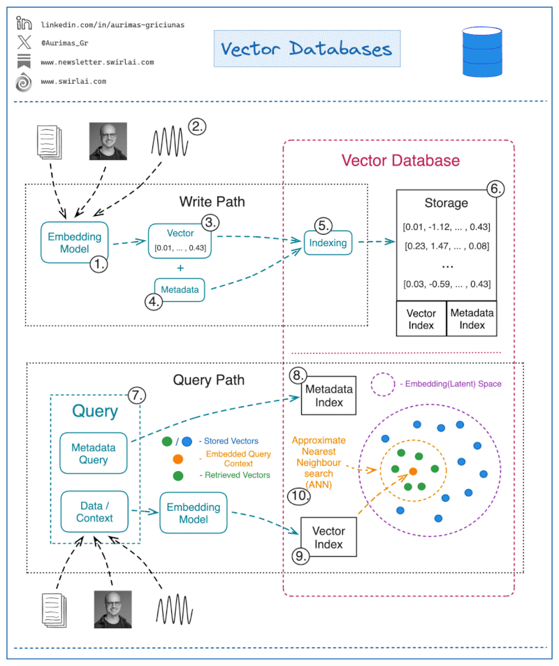

---
---
# All Links July 2024

#### Encoding


* Into's and principles from key players
  * video [Geoffrey Hinton: The Foundations of Deep Learning](https://youtu.be/zl99IZvW7rE?si=5RyCsj58Za4_LMGW)
  * linkedin [Breaking down generative AI’s common misconceptions](https://www.linkedin.com/pulse/breaking-down-generative-ais-common-misconceptions-google-cloud?utm_source=share&utm_medium=member_android&utm_campaign=share_via)
  * Video: [A Hackers' Guide to Language Models](https://youtu.be/jkrNMKz9pWU?si=YuVhdO0Vgx-yZE5E)
  * video [A Machine Learning Primer: How to Build an ML Model](https://youtu.be/Vx2DpMgplEM?si=ElGW-y-dOWvREzAj)

* Free Books:
  * github [llm book](https://github.com/VincentGranville/Large-Language-Models)

* **Encoding**. Encoding is the process of mapping words/word-fragments into a numerical representation that a Large Language model can process. One-hot encoding and Vector spaces are typically used. The mapping from a discrete space of words with distinct meaning to a continuous space of semantic meaning is subtle. However, it's key to applying predictive analytics to language.
  * [Word to Vec Tutorial](https://www.kaggle.com/code/pierremegret/gensim-word2vec-tutorial)
  * Cassie Kozyrkov [What are: Embeddings? Vector Databases? Vector Search? k-NN? ANN?](https://kozyrkov.medium.com/what-are-embeddings-vector-databases-vector-search-k-nn-ann-9eb35f715c94)
  * aman.ai on [Tokenization](http://tokenizer.aman.ai) & [Word Vectors/Embeddings](http://embeddings.aman.ai)

* Conceptual Frameworks
  * [Geometric Deep Learning](https://geometricdeeplearning.com/lectures/) What is this? 10 Lectures to find out.
  * [Categorical Deep Learning](https://categoricaldeeplearning.com/)

* Diffusion Models
  * [Diffusion Models](https://theaisummer.com/diffusion-models/)
  * [Maths for Diffusion Models - from scratch](https://theaisummer.com/diffusion-models/)

* Formal (free) AI courses
  * **Beginner**:
    * [Introduction to AI - IBM](https://www.coursera.org/learn/introduction-to-ai)
    * [AWS: Intro to Generative AI](https://explore.skillbuilder.aws/learn/course/external/view/elearning/17176/introduction-to-generative-ai-art-of-the-possible)
    * [AWS: Prompt Engineering Intro](https://explore.skillbuilder.aws/learn/course/external/view/elearning/17763/foundations-of-prompt-engineering)
    * Harvard [CS50AI](https://pll.harvard.edu/course/cs50s-introduction-artificial-intelligence-python/2023-05). Introduction to AI by Harvard
    * Harvard [Teaching CS50 with AI](https://cs.harvard.edu/malan/publications/V1fp0567-liu.pdf)
    * Google [Free GenAI training Cources](https://cloud.google.com/blog/topics/training-certifications/new-google-cloud-generative-ai-training-resources)
    * [Full Stack LLM Bootcamp](https://fullstackdeeplearning.com/llm-bootcamp/)
    * Hugging Face [LLM training](https://docs.google.com/presentation/d/11pekVtopYVgUNYTxKHFqM01E10jmdZnzlkocueQYqjI/edit?usp=sharing)


  * **Intermediate**:
    * [ML with Python - IBM](https://www.coursera.org/learn/machine-learning-with-python)
    * [Tensorflow Google Cloud](https://www.coursera.org/learn/intro-tensorflow)
    * [Structuring ML Projects](https://www.coursera.org/learn/machine-learning-projects)

  * **Advanced**:
    * [Prompt Engineering Pro](https://learnprompting.org)
    * [Advance ML - Google](https://www.coursera.org/specializations/advanced-machine-learning-tensorflow-gcp)
    * [Advanced Algos - Stanford](https://www.coursera.org/learn/advanced-learning-algorithms?specialization=machine-learning-introduction)
  
  * **To assess**
    * [Prompt Engineering Pro](https://learnprompting.org)
    * [Google's Ethical AI](https://www.cloudskillsboost.google/course_templates/554)
    * [Machine Learning by Harvard](https://pll.harvard.edu/course/data-science-machine-learning)
    * [Understanding Language Models by LangChain](https://www.deeplearning.ai/short-courses/langchain-for-llm-application-development/)
    * [Bing Chat Applications](https://www.linkedin.com/learning/streamlining-your-work-with-copilot-formerly-bing-chat-bing-chat-enterprise/put-your-fingers-to-work-chatting-as-a-productivity-tool) Linked in Learning
    * [Generative AI by Microsoft](https://learn.microsoft.com/en-us/training/paths/introduction-generative-ai/)
    * [Amazon's AI Strategy](https://explore.skillbuilder.aws/learn/public/learning_plan/view/1909/generative-ai-learning-plan-for-decision-makers) For Decision Makers
    * [AI for Everyone](https://www.deeplearning.ai/courses/generative-ai-for-everyone/)
    * [AWS AI Foundations](https://www.coursera.org/learn/generative-ai-with-llms)
    * [Free AI Cources](https://www.linkedin.com/posts/realdanjacobs_digitaltransformation-technology-digital-activity-7151239506250063872-1fPc?utm_source=share&utm_medium=member_ios)

* The building blocks of LLMs
  * video [Transformers demystified: how do ChatGPT, GPT-4, LLaMa work?](https://youtu.be/C6ZszXYPDDw?si=bq6Ig2btHuVjNkW0)
  * [GenAI and LLM key concepts](https://www.datasciencecentral.com/genai-and-llm-key-concepts-you-need-to-know/)
  * [Multi-head Attention](https://www.linkedin.com/posts/sebastianraschka_if-you-enjoy-from-scratch-implementations-activity-7171159079627767808-YyVl?utm_source=share&utm_medium=member_ios)
  * Video: [Transformers demystified](https://youtu.be/C6ZszXYPDDw) how do ChatGPT, GPT-4, LLaMa work? Niel Rogge YouTube
  * [Understanding and Coding the Self-Attention Mechanism of Large Language Models From Scratch](https://bit.ly/3YFZc59)
  * GitHub [LLM's from Scratch](https://github.com/rasbt/LLMs-from-scratch/blob/main/ch03/02_bonus_efficient-multihead-attention/mha-implementations.ipynb) and the  [BOOK](https://www.manning.com/books/build-a-large-language-model-from-scratch?utm_source=raschka&utm_medium=affiliate&utm_campaign=book_raschka_build_12_12_23&a_aid=raschka&a_bid=4c2437a0&chan=mm_github)
  * [Practical Machine Learning](https://github.com/VincentGranville/Large-Language-Models)
  * [LLMs from Scratch](https://github.com/rasbt/LLMs-from-scratch)
  * [AI Essentials](https://explore.skillbuilder.aws/learn/course/external/view/elearning/17763/foundations-of-prompt-engineering).  AWS Foundations of prompt engineering
  * [GenAI Live Workshop](https://brij.guru/ai) Building with Googles Gemma Models
  * [ChatGPT Mastery](https://www.deeplearning.ai/short-courses/chatgpt-prompt-engineering-for-developers/) Free Course in collaberation with OpenAI
  * [Google AI Magic](https://www.cloudskillsboost.google/course_templates/536) Google GenAI Intro training
  * [Microsoft AI Basics:](https://www.linkedin.com/learning/what-is-generative-ai/generative-ai-is-a-tool-in-service-of-humanity) Linked in Learning
  * [GenAI and LMM Key concepts](https://www.datasciencecentral.com/genai-and-llm-key-concepts-you-need-to-know/)
  * [Understanding and Coding the Self-Attention Mechanism of Large Language Models From Scratch](https://sebastianraschka.com/blog/2023/self-attention-from-scratch.html?utm_source=substack&utm_medium=email)
  * [The Transformer Layer by Layer](https://mlbootcamp.ai/course.html?guid=d105240a-94e1-405b-be80-60056659c24c)
  * aman.ai [Attention](http://attention.aman.ai),  [Transformers](http://transformer.aman.ai),  [Overview of LLMs](http://llm.aman.ai)
  * video [Cracking the Code: The Mathematical Secrets of Transformers](https://youtu.be/0WHZESuwVC4?si=87nbiwLBfA6VLpOP)
  * Video: [Mathematics for Machine Learning](https://m.youtube.com/playlist?list=PLcPXq_8xLMgHupm4NZNgVqJcsdiFO1RE1)


* **RAG** Retrieval Augmented Generation. 
  * Hugging face [RAFT: Adapting Language Model to Domain Specific RAG](https://huggingface.co/papers/2403.10131) paper. Microsoft 
  * Microsoft [RAFT:  A new way to teach LLMs to be better at RAG](https://techcommunity.microsoft.com/t5/ai-ai-platform-blog/raft-a-new-way-to-teach-llms-to-be-better-at-rag/ba-p/4084674) paper. 
  * Video [langchain: Is RAG Really Dead? Testing Multi Fact Retrieval & Reasoning in GPT4-128k](https://www.youtube.com/watch?v=UlmyyYQGhzc)
  * [Knowledge Graphs for RAG](https://learn.deeplearning.ai/courses/knowledge-graphs-rag/lesson/1/introduction)

* Fine Tuning
  * LightnigAI  [Code LoRA from Scratch](https://lightning.ai/lightning-ai/studios/code-lora-from-scratch)
  * aman.ai [Parameter Efficient Fine-Tuning](http://peft.aman.ai)
  * github [Fine-Tuning with LoRA or QLoRA](https://github.com/ml-explore/mlx-examples/tree/main/lora)

* Applied LLMs, Frameworks for Agents, RAG, memory and Reasoning.
  * [Phidata](https://github.com/phidatahq/phidata)  is a toolkit for building AI Assistants using function calling.

Use Cases
* [SQL LLM. Ditch SQL — Let Vanna Handle It!](https://levelup.gitconnected.com/ditch-sql-let-vanna-handle-it-f14289d0a32f)

* Building Solutions with AI
  * [Compound AI Systems](https://bair.berkeley.edu/blog/2024/02/18/compound-ai-systems/)

* Data
  * [Ahead of AI #8: The Latest Open Source LLMs and Datasets](https://www.linkedin.com/pulse/ahead-ai-8-latest-open-source-llms-datasets-sebastian-raschka-phd?utm_source=share&utm_medium=member_android&utm_campaign=share_via)

* Reinforcement Learning
  * HuggingFace [Deep Reinforcement Learning Course](https://huggingface.co/learn/deep-rl-course/unit0/introduction?utm_source=substack&utm_medium=email)
  * [Reinforcement Learning](https://kamyar.page/teaching/fall_CS59000_RL_2020.html)

* Dunno
  * Facebook research [MetaClip](https://github.com/facebookresearch/MetaCLIP) Demystifying CLIP Data

* Tools for AI engineers
  * github [ManimML](https://github.com/helblazer811/ManimML) Python tools for ML Presentations

* Keeping up with the Research
  * [Open challenges in LLM research](https://huyenchip.com/2023/08/16/llm-research-open-challenges.html?utm_source=substack&utm_medium=email)
  * [Understanding Deep Learning in Python](https://www.linkedin.com/posts/simon-prince-615bb9165_phew-finally-finished-all-68-python-notebook-activity-7130190400266330112-5n_X?utm_source=share&utm_medium=member_ios)
  * Sebastian Raschka, PhD
    * [Research Papers in Jan 2024:](https://magazine.sebastianraschka.com/p/research-papers-in-january-2024?utm_campaign=post&utm_medium=web)  Model Merging, Mixtures of Experts, and Towards Smaller LLMs. EBASTIAN RASCHKA
    * [Research Papers in Feb 2024:](https://magazine.sebastianraschka.com/p/research-papers-in-february-2024?utm_campaign=post&utm_medium=web) A LoRA Successor, Small Finetuned LLMs Vs Generalist LLMs, and Transparent LLM Research, EBASTIAN RASCHKA
    * [Personal Coding Assistnat](https://docs.google.com/presentation/d/17gYjRsfNYoG4oyQMx23goHI1viyh15Gdwij-D3ZGNOs/mobilepresent?slide=id.g2bd85565846_0_90). How to build your own


Google
  * video [ntroduction to Llama 2 on Google Cloud](https://www.youtube.com/watch?v=hvYWp1-J4jk)
  * Google [Supercharging Vertex AI with Colab Enterprise and MLOps for generative AI](https://goo.gle/3Py2cip)


* github [mistral AI MegaBlocks](https://github.com/mistralai/megablocks-public)
* Hugging Face [MOE](https://huggingface.co/blog/moe)
* [aman.ai](https://aman.ai) Comprehensive catalogue of cources, papers, links to learn about GenAI and more. 
This catalog of NLP Primers focuses on important topics such as:

* aman.ai - file in topics
  * [NLP Tasks](http://nlp-tasks.aman.ai)
  * [Neural Architectures](http://arch.aman.ai)
  * [LLM Alignment](http://alignment.aman.ai)
  * [Retrieval Augmented Generation (RAG)](http://rag.aman.ai)
  * [Token Sampling Methods](http://token-smple.aman.ai)
  * [Context Length Extension](http://llm-context.aman.ai)
  * [Autoregressive vs. Autoencoder Models](http://enc-dec.aman.ai)
  * [Evaluation Metrics](http://metrics.aman.ai)
  * [Textual Entailment](http://entailment.aman.ai)
  * [BERT](http://bert.aman.ai)
  * [GPT](http://gpt.aman.ai)
  * [Llama](http://llama.aman.ai)
  * [Toolformer](http://toolformer.aman.ai)
  * [Knowledge Graphs](http://kg.aman.ai)
  * [Hallucination Mitigation](http://hallu-mitgn.aman.ai)
  * [Named Entity Recognition](http://ner.aman.ai)
  * [Machine Translation](http://translatn.aman.ai)
  * [AI Generated Text Detection Techniques](http://ai-detect.aman.ai)
  * [Document Intelligence](http://doc-intel.aman.ai)

* [Gemini Github pages](https://github.com/GoogleCloudPlatform/generative-ai)
* [The Transformer Blueprint: A Holistic Guide to the Transformer Neural Network Architecture](https://deeprevision.github.io/posts/001-transformer/)

* [Wolfram LLM](https://writings.stephenwolfram.com/2023/02/what-is-chatgpt-doing-and-why-does-it-work/) What is ChatGPT Going and why does it work

Google 
  * [Google Tutorial on recognising images](https://teachablemachine.withgoogle.com)


* Coding assistants
  * StartCoder
    * [StarCoder Slides](https://docs.google.com/presentation/d/11pekVtopYVgUNYTxKHFqM01E10jmdZnzlkocueQYqjI/edit?usp=sharing)
  * Hugging Face[building a personal coding assistant](https://docs.google.com/presentation/d/17gYjRsfNYoG4oyQMx23goHI1viyh15Gdwij-D3ZGNOs/mobilepresent?slide=id.g2bd85565846_0_90)


* github [llama.cpp](https://github.com/ggerganov/llama.cpp/pull/2926)

Implementing LLMs - then Engineering 
* Automatic Differentiation
  * [Understanding Automatic Differentiation in 30 lines of Python](https://vmartin.fr/understanding-automatic-differentiation-in-30-lines-of-python.html?utm_source=substack&<)

Notable Review Papers
  * Paper [ChatGPT’s One-year Anniversary: Are Open-Source Large Language Models Catching up?](https://arxiv.org/pdf/2311.16989.pdf)

github [Large Language Model Course](https://github.com/mlabonne/llm-course)
paper [From Google Gemini to OpenAI Q* (Q-Star): A Survey of Reshaping the Generative Artificial Intelligence (AI) Research Landscape](https://arxiv.org/abs/2312.10868)
pytorch [Inside the Matrix: Visualizing Matrix Multiplication, Attention and Beyond](https://pytorch.org/blog/inside-the-matrix/?utm_source=substack&utm_medium=email)
[Dev Locally With LLMs](https://grumpygrace.dev/posts/dev-locally-with-llms/)

* mlabonie [llm cource](https://github.com/mlabonne/llm-course?utm_source=www.aifire.co&utm_medium=newsletter&utm_campaign=tesla-bot-transforming-economics-with-robotics)
* linkedin [leasrning cources](https://www.linkedin.com/posts/simon-prince-615bb9165_are-you-teaching-a-deep-learning-course-this-activity-7148718602517430272-zAwW?utm_source=share&)
* [Understanding Deep Learning](https://udlbook.github.io/udlbook/)
* [Huggingface Phi 2](https://huggingface.co/microsoft/phi-2)
* Paper [Mathematical Introduction to Deep Learning: Methods, Implementations, and Theory](https://arxiv.org/abs/2310.20360)
* [Mixtral in Colab](https://github.com/dvmazur/mixtral-offloading/blob/master/notebooks/demo.ipynb)

* Open Source Models
  * Running LLMs locally
    * medium [6 Ways to Run LLMs Locally](https://semaphoreci.medium.com/6-ways-to-run-llms-locally-fa25be0797e5)
    * [Running Mistral 8x7Bs Mixture of Experts on a Macbook](https://mattmazur.com/2023/12/13/running-mistral-8x7bs-mixture-of-experts-on-a-macbook/)
  * GKE serving
    * medium [Serving Open Source LLMs on GKE using vLLM framework](https://medium.com/google-cloud/serving-open-source-llms-on-gke-using-vllm-framework-5e522b3679ee)
  * Select OSS Models
    * [Mistral 7B](https://mistral.ai/news/announcing-mistral-7b/)
    * [gemma on hugging face](https://huggingface.co/blog/gemma)

* Concepts and Techniques - beyond the basics
  * [Physics-enhanced deep surrogates for PDEs](https://dspace.mit.edu/handle/1721.1/153164)
  
How-To's
  * [Deep Learning with PyTorch: A 60 Minute Blitz](https://pytorch.org/tutorials/beginner/deep_learning_60min_blitz.html)
  * **** [How to Convert Any Text Into a Graph of Concepts](https://towardsdatascience.com/how-to-convert-any-text-into-a-graph-of-concepts-110844f22a1a)

* medium [Configure LM Studio for Apple Silicon: Run Local LLMs with faster time to completion](https://medium.com/@ingridwickstevens/configure-lm-studio-on-apple-silicon-with-87-7-faster-generations-b713cb4de6d4)
* medium [Automate PC with LLMs](https://medium.com/@sjoerd.tiem/automate-anything-on-your-pc-for-free-using-local-llms-and-open-soure-no-code-tools-48c11f954fe1)
* [NN Visualiser](https://www.linkedin.com/posts/suwoongsik_innovation-startup-digitaltwin-activity-7159474078318297088-cxdb?utm_source=share&utm_medium=member_ios)
* video [Stanford CS25 - Transformers United](https://m.youtube.com/playlist?list=PLoROMvodv4rNiJRchCzutFw5ItR_Z27CM)
* [The Illustrated Transformer](http://jalammar.github.io/illustrated-transformer/)
* [ML algo learning](https://www.linkedin.com/posts/eric-vyacheslav-156273169_this-might-be-the-best-repo-to-understand-activity-7163950415884091392-FNkg?utm_source=share&)
* paper [Gemini 1.5: Unlocking multimodal understanding across millions of tokens of context](https://storage.googleapis.com/deepmind-media/gemini/gemini_v1_5_report.pdf)
* [Training Your Own AI Model Is Not As Hard As You (Probably) Think](https://www.builder.io/blog/train-ai)
* [Towards practical reinforcement learning for tokamak magnetic control](https://www.sciencedirect.com/science/article/pii/S0920379624000140)
* [Run inderrence with Gemma](https://cloud.google.com/dataflow/docs/machine-learning/gemma-run-inference)
* [Categorical Deep Learning](https://categoricaldeeplearning.com/)
* Berkeley AI[From Models to Compound AI Systems](https://bair.berkeley.edu/blog/2024/02/18/compound-ai-systems/)
* [LLMs from Scratch](https://github.com/rasbt/LLMs-from-scratch)
* [Authentik](https://goauthentik.io/) IAM and identity
* seb [Research Papers in February 2024: A LoRA Successor, Small Fine-tuned LLMs Vs Generalist LLMs, and Transparent LLM Research](https://magazine.sebastianraschka.com/p/research-papers-in-february-2024?utm_campaign=post&utm_medium=web)
* seb [Model Merging, Mixtures of Experts, and Towards Smaller LLMs](https://magazine.sebastianraschka.com/p/research-papers-in-january-2024?utm_campaign=post&utm_medium=web)
 github [Comparing Efficient Multi-Head Attention Implementations](https://github.com/rasbt/LLMs-from-scratch/blob/main/ch03/02_bonus_efficient-multihead-attention/mha-implementations.ipynb)
* Pre Book [Build a Large Language Model (From Scratch)](https://www.manning.com/books/build-a-large-language-model-from-scratch?utm_source=raschka&utm_medium=affiliate&utm_campaign=book_raschka_build_12_12_23&a_aid=raschka&a_bid=4c2437a0&chan=mm_github)
* [Geometric Deep Learning](https://geometricdeeplearning.com/lectures/)
* ln [Linked in - AI Course list](https://www.linkedin.com/posts/theresanaiforthat_ai-artificialintelligence-generativeai-activity-7170235664427397121-O6dN?utm_source=share&utm_medium=member_ios)
* [Generative AI Design Patterns: A Comprehensive Guide](https://towardsdatascience.com/generative-ai-design-patterns-a-comprehensive-guide-41425a40d7d0)
* ln [Yann LeCun](https://www.linkedin.com/posts/yann-lecun_parm-prmshra-on-x-activity-7172266619103080448-iqvP?utm_source=share&utm_medium=member_ios)
* [A beginner's guide to building a Retrieval Augmented Generation (RAG) application from scratch](https://learnbybuilding.ai/tutorials/rag-from-scratch)
* [Math: Spearman's correlation Coefficient](https://www.sciencedirect.com/topics/mathematics/spearmans-coefficient)

* [Needle in a haystack](https://github.com/gkamradt/LLMTest_NeedleInAHaystack), [Write-up](https://blog.langchain.dev/multi-needle-in-a-haystack/), Short video [explainer](https://www.youtube.com/watch?v=UlmyyYQGhzc)
* ORPO Odds Ratio Preference Optimisation: [Paper](https://huggingface.co/papers/2403.07691), [Github](https://github.com/xfactlab/orpo), [Model](https://huggingface.co/kaist-ai/mistral-orpo-beta)
* Video:  Building long context RAG from scratch with RAPTOR + Claude3 (Video), [Video](https://www.youtube.com/watch?v=jbGchdTL7d0), [Code](https://github.com/langchain-ai/langchain/blob/master/cookbook/RAPTOR.ipynb), [Paper](https://arxiv.org/html/2401.18059v1)
* [Visualising a transformer page](https://bbycroft.net/llm?utm_source=substack&utm_medium=email)


* We can think, even if our language abilities are destroyed by a stroke.
Language is a way to express thoughts, but thoughts, memories, and reasoning exist without language.
Favorite quote from this MIT piece: "This language system seems to be distinct from regions that are linked to our ability to plan, remember, reminisce on past and future, reason in social situations, experience empathy, make moral decisions, and construct one’s self-image. Thus, vast portions of our everyday cognitive experiences appear to be unrelated to language per se

#### Applicatons of ML

Blog on passing an entire codebase into gemini and asking questions [here](https://www.reddit.com/r/singularity/comments/1atjz9v/ive_put_a_complex_codebase_into_a_single/?rdt=36971)

* github [facefusion](https://github.com/facefusion/facefusion) Face Swapper
* github [VALL-E X: Multilingual Text-to-Speech Synthesis and Voice Cloning](https://github.com/Plachtaa/VALL-E-X)
* [Incorporating Machine Learning into Established Bioinformatics Frameworks](https://pubmed.ncbi.nlm.nih.gov/33809353)

#### Financial Markets

* [A novel computational fluid dynamics framework for turbulent flow research](https://blog.research.google/2023/09/a-novel-computational-fluid-dynamics.html)
* [Stock Market Sentiment Prediction](https://levelup.gitconnected.com/stock-market-sentiment-prediction-with-openai-and-python-ea2e2261fcbf)

#### AI Hardware

* google [Expanding our AI-optimized infrastructure portfolio: Introducing Cloud TPU v5e and announcing A3 GA](https://cloud.google.com/blog/products/compute/announcing-cloud-tpu-v5e-and-a3-gpus-in-ga)

----------

### Hardware and Maker

* [Warick Open Source Microscope](https://www.wosmic.org/) A Microsocpe you can build from Bath uni
* HARDWARE: [video Streaming HDMI sender](https://www.pulse-eight.com/p/203/neoultra-hdmi-extender-set)
* HDMI Hardware [4K UHD HDMI over Cat5e / Cat6 HDBaseT Extender with IR, 70m](https://cpc.farnell.com/pro-signal/psg3080/70m-hdbaset-lite-4kx2k-hdmi-extender/dp/AV28197)
* medium [Alternatives to Parallels Desktop on M1, M2 and M3 Macs](https://medium.com/@oleg.tarasov/alternatives-to-parallels-desktop-on-m1-m2-and-m3-macs-85b5a3822fe2)
* Meta Search engine[Synology Install SearXNG With Portainer](https://mariushosting.com/synology-install-searxng-with-portainer/)

## Finance

* Video [It's not the technology | Why banking is broken ft. Ewan Silver](https://www.youtube.com/watch?v=3DoXkkFUGSo)

## Physics

* Physics: [The standard Model](https://www.symmetrymagazine.org/article/the-deconstructed-standard-model-equation)

:::warning
Need to Add links to these:

* terraform-up-and-running.pdf 
* Monolith to Microservices Evolutionary Patterns to Transform Your Monolith by Sam Newman.pdf • 273
* Clean_Code_Robert_C_Martin.pdf • 462 pages document omitted
* A Short History of Nearly Everything.pdf • 298 pages document omitted
* REST-in-Practice.pdf • 448 pages document omitted
* The Art of Unix Programming.pdf •549 pages document omitted
* You Don't Know JS Yet - Get Started.epub document omitted

An_Introduction_to_Deep_Reinforcement_Learning_230828_083249.pdf
[Intro to Reinforcement Learning](https://web.stanford.edu/class/psych209/Readings/SuttonBartoIPRLBook2ndEd.pdf)

:::

:::info
'Atomic Habits' is the world’s most comprehensive guide on habit formation.

Here’s a brief, no-fluff summary of the most important and actionable ideas in the book:

𝟭. Make it Obvious:
Identify a habit you want to start. Place visible reminders around your environment. For instance, if you want to start reading more, leave a book on your pillow each morning after making your bed.

𝟮. Make it Atractive:
Combine a habit you need to do with one you want to do. For example, if you want to exercise but love watching TV, allow yourself to watch your favourite show only while working out.

𝟯. Make it Easy:
Simplify your new habit. If you're trying to eat healthier, prepare a week’s worth of healthy snacks on Sunday, so you have easy access to them throughout the week.

𝟰. Make it Satisfying
Reward yourself immediately after doing your new habit. If you’ve just completed a workout, treat yourself to a relaxing sauna.

𝟱. The Two Minute Rule:
Break down your habits into tasks that can be started in under two minutes. If you want to practice an instrument daily, start with just playing for two minutes, and you’ll inevitably continue for longer.

𝟲. Havit Stacking
Link a new habit to an existing one. After brushing your teeth (existing habit), immediately do two minutes of meditation (new habit).

𝟳. The Law of Least Effort:
Arrange your environment to support your new habits. If you’re trying to stop doom-scrolling late at night, leave your phone outside of your bedroom.

𝟴. The Goldilocks Rule
Habits should be neither too hard nor too easy. If you're learning a language, don’t try to read a complex novel right away; start with a simple article.

𝟵. The Rule of Family and Friends
Share your goals with friends or family. Join or create a group where members hold each other accountable for their habits, like a book club.

𝟭𝟬. Track your Habits
Keep a habit tracker to make progress visible and keep you motivated. This could be a simple calendar where you mark each day you complete your habit or an app that helps you monitor your progress.
:::


* Langraph [Building language agents as graphs](https://python.langchain.com/docs/langgraph)
* [Sakana AI](https://sakana.ai/evolutionary-model-merge/)
* Hugging Face[GaLore: Memory-Efficient LLM Training by Gradient Low-Rank Projection](https://huggingface.co/papers/2403.03507)
* Hugging Face [GaLore: Advancing Large Model Training on Consumer-grade Hardware](https://huggingface.co/blog/galore)

* [Understanding and Coding Self-Attention, Multi-Head Attention, Cross-Attention, and Causal-Attention in LLMs](https://magazine.sebastianraschka.com/p/understanding-and-coding-self-attention)
* Medium [LangChain SQL Agent for Massive Documents Interaction](https://pub.towardsai.net/langchain-sql-agent-for-massive-documents-interaction-510fc4bc65a4)
* [marketStack](https://marketstack.com/) Real-time, Intra-day & Historical Market-data API
* [gpt-llm-trainer](https://github.com/mshumer/gpt-llm-trainer) Open Source project with colab's on fine-tuning small models. No longer actively maintained. 
* [Building ToolLLM With LangGraph.js](https://m.youtube.com/watch?v=xbZzJjBm6t4) Live coding video - RAG + Tools
* [LLM Course](https://github.com/mlabonne/llm-course?utm_source=substack&utm_medium=email) Lot's of colabs. Fundamentals to Applications
* [Building a Math Application with LangChain Agents](https://towardsdatascience.com/building-a-math-application-with-langchain-agents-23919d09a4d3) Blog
* [starcoder2](https://www.kaggle.com/models/bigcode-project/starcoder2) on kaggle. StarCoder2 is a family of code generation models (3B, 7B, and 15B), trained on 600+ programming languages from The Stack v2 and some natural language text such as Wikipedia, Arxiv, and GitHub issues. [starcoder preprint](https://arxiv.org/abs/2305.06161)
* [What is LangChain?](https://m.youtube.com/watch?v=1bUy-1hGZpI)video by IBM. Generic interface for any LLM. 
* [How to measure and improve developer productivity | Nicole Forsgren (Microsoft Research, GitHub, Google)](https://www.lennyspodcast.com/how-to-measure-and-improve-developer-productivity-nicole-forsgren-microsoft-research-github-goo/) Lenny Rachitsky with Nicola Forsgren
* [TWINT - Twitter Intelligence Tool](https://github.com/twintproject/twint) scraping tweets from X. Not maintained
* [Perplexity-Inspired LLM Answer Engine](https://github.com/developersdigest/llm-answer-engine) on github
* Finance [Gaussian polynomial volatility models](https://www.linkedin.com/posts/alberto-bueno-guerrero-253926a8_finance-mathematics-markets-activity-7180276765930512384-NzIS?utm_source=share&utm_medium=member_ios) on linkedin
* [Teaching Large Language Models to Reason with RL](https://huggingface.co/papers/2403.04642) paper
* [The Unreasonable Ineffectiveness of the Deeper Layers](https://www.linkedin.com/posts/andrew-iain-jardine_llama-opensource-activity-7180552557382045696-LbBb?utm_source=share&utm_medium=member_ios) paper - Mar 24. 
* [Open Source AI cookbook](https://github.com/huggingface/cookbook) github - huggingface
* [Finetune Mixtral 8x7B with AutoTrain](https://huggingface.co/blog/abhishek/autotrain-mixtral-dgx-cloud-local) on HuggingFace
* [Microsoft GenAI for Beginners](https://github.com/microsoft/generative-ai-for-beginners)
* Building a RAG application using open-source models (Asking questions from a PDF using Llama2) [video](https://www.youtube.com/watch?v=HRvyei7vFSM) and [code](https://github.com/svpino/llm)
*  [vlogger](https://enriccorona.github.io/vlogger/) Multimodal Diffusion for Embodied Avatar Synthesis
* TD Securities Google [blog](https://cloud.google.com/transform/td-securities-tdsat-automating-fixed-income-bond-trading) on FI Trading with Gemini
* Hugging face example repo - absolute minimum [minimal training zoo](https://github.com/muellerzr/minimal-trainer-zoo)
* The Rise of Chief AI Officer - The [CAIO](https://www.kdnuggets.com/the-rise-of-chief-ai-officer) role
* [FastAPI](https://datascientest.com/en/fastapi-everything-you-need-to-know-about-the-most-widely-used-python-web-framework-for-machine-learning) for ML
* [Serverless AI Chat with RAG using LangChain.js](https://github.com/Azure-Samples/serverless-chat-langchainjs?tab=readme-ov-file) on github
* [Understanding Deep Learning](https://udlbook.github.io/udlbook/) book and [notebooks](https://udlbook.github.io/udlbook/)
* [Ten Noteworthy AI Research Papers of 2023](https://magazine.sebastianraschka.com/p/10-ai-research-papers-2023) Sebastian Raschka
* [A Technical Introduction to Stable Diffusion](https://machinelearningmastery.com/a-technical-introduction-to-stable-diffusion/) blog. 
* [Google AI Hypercomputer](https://cloud.google.com/blog/products/compute/whats-new-with-google-clouds-ai-hypercomputer-architecture?utm_campaign=6017a8d20faf2d00010e2a46&utm_content=661557677e52be0001b07426&utm_medium=smarpshare&utm_source=linkedin&utm_term=-) blog, April 2024
* [Torrent link to mixtral-8x22b](magnet:?xt=urn:btih:9238b09245d0d8cd915be09927769d5f7584c1c9&dn=mixtral-8x22b&tr=udp%3A%2F%http://2Fopen.demonii.com%3A1337%2Fannounce&tr=http%3A%2F%https://lnkd.in/gxXYyMQQ%3A1337%2Fannounce)
* [Llama.cpp Tutorial: A Complete Guide to Efficient LLM Inference and Implementation](https://www.datacamp.com/tutorial/llama-cpp-tutorial) blog, Dec 24
* [The Open Source Market’s in Flux. How Can IT Managers Cope?](https://thenewstack.io/the-open-source-markets-in-flux-how-can-it-managers-cope/) blog, April 24. 
* [Formal Aspects of Language Modeling](https://arxiv.org/abs/2311.04329) paper, Nov 23. Large language models have become one of the most commonly deployed NLP inventions. In the past half-decade, their integration into core natural language processing tools has dramatically increased the performance of such tools, and they have entered the public discourse surrounding artificial intelligence. Consequently, it is important for both developers and researchers alike to understand the mathematical foundations of large language models, as well as how to implement them. These notes are the accompaniment to the theoretical portion of the ETH Zürich course on large language models, covering what constitutes a language model from a formal, theoretical perspective.
* [Retrieval Augmented Generation(RAG) — Chatbot for documents with LlamaIndex](https://abvijaykumar.medium.com/retrieval-augmented-generation-rag-with-llamaindex-1828ef80314c) Feb 2024. Medium Blog. 
* [Expanding the AI Stock Analysis Agent with Fundamental and Technical Tools](https://sethhobson.com/2024/04/expanding-the-ai-stock-analysis-agent-with-fundamental-and-technical-tools/) blog. 
* [Lightnig AI](https://lightning.ai/) Free trial signup
* JetMoE: Reaching Llama2 Performance with 0.1M Dollars. Huggingface [paper](https://huggingface.co/papers/2404.07413),  [github](https://github.com/myshell-ai/JetMoE),  [models](https://huggingface.co/models?other=jetmoe)

* [RAG from Scratch](https://www.youtube.com/watch?v=sVcwVQRHIc8) Video, Lang Martin from LangChain
* [SOAR: New algorithms for even faster vector search with ScaNN](https://research.google/blog/soar-new-algorithms-for-even-faster-vector-search-with-scann/) Google research paper. April, 24
* Fine-tune Llama 3 with ORPO [colab](https://colab.research.google.com/drive/1eHNWg9gnaXErdAa8_mcvjMupbSS6rDvi?usp=sharing), [model](https://huggingface.co/mlabonne/OrpoLlama-3-8B), [article](https://huggingface.co/blog/mlabonne/orpo-llama-3)
* Local RAG with LLaMA3 and Langchain [video](https://www.youtube.com/watch?v=-ROS6gfYIts), [notebooks](https://github.com/langchain-ai/langgraph/blob/main/examples/rag)
* Google VertexAI [AgentBuilder](https://cloud.google.com/blog/products/ai-machine-learning/build-generative-ai-experiences-with-vertex-ai-agent-builder?utm_source=linkedin&utm_medium=unpaidsoc&utm_campaign=fy24q2-googlecloud-blog-next_event-in_feed-no-brand-global&utm_content=-&utm_term=-&linkId=9638052)
* [Diffusion models from scratch, from a new theoretical perspective](https://www.chenyang.co/diffusion.html?utm_source=substack&utm_medium=email), 
* How to measure Anything, Hubbard - O'Riely 

LLama Server on mac
```bash
brew install ggerganov/ggerganov/llama.cpp
2. llama-server --model <path to model> -c 2048
```

